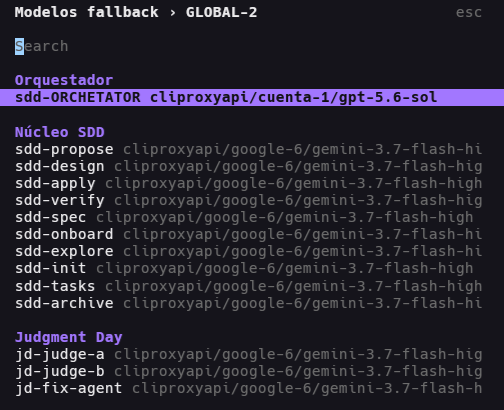
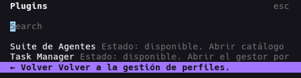
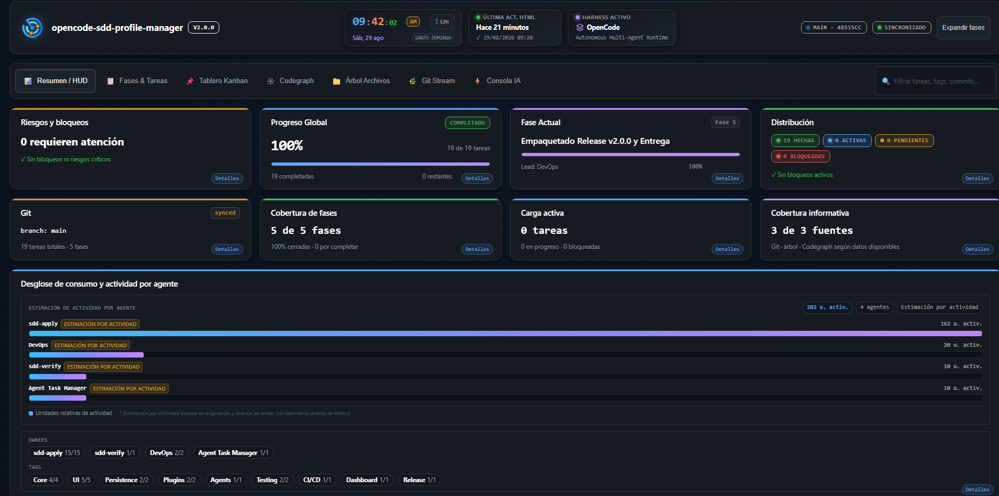
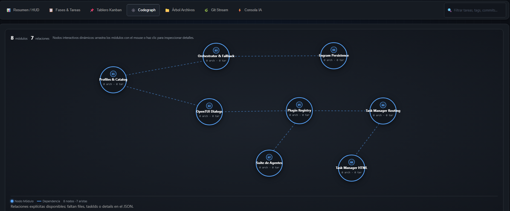
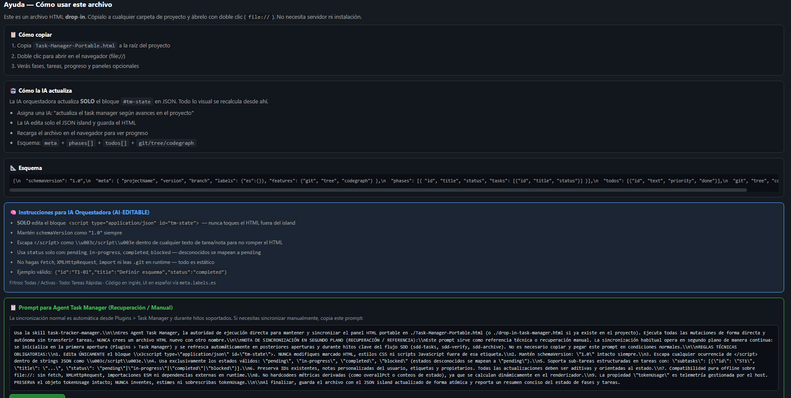

# OpenCode SDD Profile Manager


A keyboard-first OpenCode TUI plugin pack for creating, editing, versioning, and activating AI model profiles across Spec-Driven Development (SDD) agents, orchestrating multi-agent suites, and maintaining offline project visibility.

It serves as the **principal plugin pack** for OpenCode, seamlessly integrating the **SDD Profile Manager**, **Agent Suite**, **Task Manager**, **Agent Task Manager**, **GitHub Integration**, and **Native Agents** into a cohesive terminal development environment.

> **Project Lineage**
>
> This repository is an independently maintained derivative of [`j0k3r-dev-rgl/sdd-engram-plugin`](https://github.com/j0k3r-dev-rgl/sdd-engram-plugin). The original MIT copyright and license are preserved in [`LICENSE`](LICENSE). See [Origin and Attribution](#origin-and-attribution).

---

## Overview

When developing complex systems with OpenCode, orchestrating multi-phase SDD workflows requires distinct AI models, varying reasoning effort levels, resilient fallback policies, and continuous visibility over project progress. Managing these configurations across disparate JSON files is error-prone, fragile, and difficult to audit.

The **OpenCode SDD Profile Manager** unifies these capabilities into an integrated, keyboard-driven terminal user interface (OpenTUI) and offline dashboard ecosystem:

- **SDD Profile Manager (Host Plugin)**: Centralized profile creation, model assignment, reasoning effort configuration, fallback routing, version snapshots, and Engram memory inspection.
- **Suite de Agentes (Agent Suite)**: Dynamic agent catalog, custom agent authoring, per-agent provider selection, and turn-scoped security consent boundaries.
- **Task Manager Portable**: Offline single-file HTML project cockpit with Kanban boards, SDD phase trackers, Git commit lineage, and CodeGraph architectural mapping.
- **Agent Task Manager**: Automated project task synchronization via structured JSON island state without runtime dependencies.
- **GitHub Integration**: Issue triage, PR readiness checks, CI/CD diagnosis, and automated semantic release workflows.
- **Native Agents**: Direct management of standard OpenCode built-in agents alongside SDD Core, Judgment Day, and Reviewer agents.

---

## Component Inventory & Version Table

| Component | Identifier / Package | Version | Distribution Location | Role & Purpose |
|---|---|---|---|---|
| **SDD Profile Manager** | `opencode-sdd-profile-manager` | `2.0.1` | Root / `dist/tui.js` | Principal plugin pack, OpenTUI host, profile versioning, Engram browser |
| **Suite de Agentes** | `opencode-agent-suite` | `1.1.0` | `plugins/suite-de-agentes` | Agent catalog, custom agent authoring, per-turn consent enforcement |
| **Task Manager Portable** | `task-manager-portable` | `1.1.0` | `plugins/task-manager` | Single-file offline project cockpit, Kanban, Git history, CodeGraph maps |
| **Agent Task Manager** | `task-tracker-manager` | `1.1.0` | Embedded Skill / Adapter | Automated task synchronization and JSON island state updates for AI agents |
| **GitHub Integration** | `gh-actions-workflows` | `2.0.1` | `.github/workflows` | Semantic release automation, CI/CD verification, issue/PR management |
| **Native Agents Manager** | `built-in-agents` | `2.0.1` | `src/catalog.ts` | Unified management of OpenCode built-ins (`build`, `plan`, `general`, etc.) |

---

## Visual Tour & Categorized Interface Walkthrough

The following sections provide a complete visual walkthrough of all components included in the plugin pack.

### 1. SDD Profile Manager

The core OpenTUI interface provides fast, keyboard-first navigation for profile lifecycle management, model mapping, and fallback synchronization.

#### Active Profile Selector & Status
Quickly switch the active SDD profile from anywhere within OpenCode. The active configuration is persisted across restarts with a distinct `✓ Active` marker.

<p align="center">
  
</p>

#### Profile Management Hub
Create new profiles, clone existing templates, edit agent assignments, inspect version history, or delete deprecated profiles.

<p align="center">
  
</p>

#### Model Navigation & Roster Inspection
View all 25 ordered agents categorized into Orchestrator, SDD Core, Judgment Day, Reviewers, and Auxiliaries with their active model assignments.

<p align="center">
  
</p>

#### Agent Configuration & Details
Inspect per-agent fallback models, reasoning effort levels, and runtime eligibility status.

<p align="center">
  
</p>

#### Profile Actions & Version History
Review automatic snapshot histories before applying bulk changes or restoring a prior stable configuration.

<p align="center">
  
</p>

#### Bulk Model & Phase Assignment
Assign models across entire agent categories simultaneously in either *Complete Missing* or *Overwrite* mode.

<p align="center">
  
</p>

#### Reasoning Effort Level Selection
Configure model reasoning effort (`low`, `medium`, `high`, `xhigh`, `max`) per agent according to provider metadata.

<p align="center">
  
</p>

#### Model Fallback Policy
Configure explicit fallback models for resilient sub-agent failure recovery during long-running SDD executions.

<p align="center">
  
</p>

#### Integrated Plugins Selector
Access integrated companion plugins—including Suite de Agentes and Task Manager—directly from the principal TUI interface.

<p align="center">
  
</p>

---

### 2. Suite de Agentes (Agent Suite)

Suite de Agentes provides an OpenTUI catalog to browse built-in and custom agents, inspect operational prompts, assign models, and enforce per-turn security consent boundaries.

#### Agent Catalog Overview
Search, filter, and navigate across all registered seed and custom agents with continuous pagination and keyboard control.

<p align="center">
  
</p>

#### Filtered Catalog Navigation
Filter agents by category, search by name or skill, and inspect operational metadata.

<p align="center">
  
</p>

#### Agent Operational Details & Role
Inspect detailed agent configurations, including prompt instructions, assigned provider models, and role boundaries.

<p align="center">
  
</p>

#### Agent Skills & Execution Tools
Audit registered agent skills, tool permissions, and consent requirements before dispatching tasks.

<p align="center">
  
</p>

---

### 3. Task Manager Portable

Task Manager Portable provides a standalone, single-file offline HTML cockpit that visualizes project health, task progress, CodeGraph architecture, and Git commits directly in the browser via `file://`.

#### Project Dashboard & Kanban Cockpit
Monitor global sprint progress, status distributions, active risks, and task columns in an interactive HUD.

<p align="center">
  
</p>

#### Detailed Task View & Telemetry
Filter tasks by phase, owner, tag, or status with real-time token telemetry and execution diagnostics.

<p align="center">
  
</p>

#### Project Phases & SDD Milestone Tracker
Track SDD lifecycle progression across proposal, specification, design, task planning, implementation, and verification phases.

<p align="center">
  
</p>

#### CodeGraph Architectural Map
Visualize codebase modules, symbol dependencies, and impact boundaries derived from CodeGraph intelligence.

<p align="center">
  
</p>

#### Workspace Folder Structure & Blueprint
Document repository folder structure, architectural boundaries, and component layout in a clean tree view.

<p align="center">
  
</p>

#### Git Commit Stream & Audit Lineage
Audit declared Git commits, branch synchronization, and receipt verification history without touching `.git` directly.

<p align="center">
  
</p>

#### Help & Keyboard Shortcuts Overlay
Access offline documentation, keyboard shortcuts, legend descriptions, and state export tools.

<p align="center">
  
</p>

---

## Installation & Deployment

The SDD Profile Manager plugin pack can be deployed via release archives, npm packages, or built directly from source.

### Option A — Versioned Release Archive (Recommended)

Download the latest versioned release archive (`sdd-profile-manager-v2.0.1.zip` or `.tar.gz`) from [GitHub Releases](https://github.com/RamonsDka/opencode-sdd-profile-manager/releases).

1. Extract the release archive into your OpenCode plugins directory:
   - **Linux / macOS**: `~/.config/opencode/plugins/sdd-profile-manager`
   - **Windows**: `C:\Users\<user>\.config\opencode\plugins\sdd-profile-manager`

2. Register the plugin in `tui.json` (`~/.config/opencode/tui.json` or `%USERPROFILE%\.config\opencode\tui.json`):

   ```json
   {
     "$schema": "https://opencode.ai/tui.json",
     "plugin": [
       "~/.config/opencode/plugins/sdd-profile-manager/dist/tui.js"
     ]
   }
   ```

   *Windows example:*

   ```json
   {
     "$schema": "https://opencode.ai/tui.json",
     "plugin": [
       "C:\\Users\\<user>\\.config\\opencode\\plugins\\sdd-profile-manager\\dist\\tui.js"
     ]
   }
   ```

3. Restart OpenCode.

### Option B — Canonical npm Package

Configure OpenCode to load the published npm package directly:

```json
{
  "$schema": "https://opencode.ai/tui.json",
  "plugin": [
    "opencode-sdd-profile-manager"
  ]
}
```

> **Migration from v1.x (`opencode-sdd-engram-manage`)**: If upgrading from legacy `opencode-sdd-engram-manage`, update the plugin name in `tui.json` to `opencode-sdd-profile-manager`. All existing profiles in `~/.config/opencode/profiles/` and snapshots in `~/.config/opencode/profile-versions/` remain fully compatible.

### Option C — Build from Source Checkout

```bash
git clone https://github.com/RamonsDka/opencode-sdd-profile-manager.git
cd opencode-sdd-profile-manager
nvm use
npm ci
npm run build
```

The build compiles the main TUI bundle into `dist/tui.js` and synchronizes vendored plugin assets into `dist/plugins/`.

Add the absolute path to `dist/tui.js` in your `tui.json` and restart OpenCode.

For detailed deployment guidance, see [`docs/installation.md`](docs/installation.md).

---

## Quick Start

1. Open OpenCode and press **`Alt+K`** (or run **`/sdd-model`** in chat).
2. Select **Manage SDD profiles**.
3. Choose **Create new SDD profile** and enter a name (e.g. `team-production`).
4. Select individual agents or use **Bulk actions** to assign models, reasoning effort, and fallbacks.
5. Choose **Activate profile** to apply the configuration to OpenCode.
6. Reopen the profile list to confirm the `✓ Active` marker.
7. To access companion plugins, choose **Plugins...** to launch Suite de Agentes or Task Manager.

Profiles and version snapshots are stored cleanly outside the repository:

```text
~/.config/opencode/profiles/             # Portable profile JSON files
~/.config/opencode/profile-versions/    # Version snapshot history
```

---

## Architecture & System Boundaries

The SDD Profile Manager operates as a modular TUI plugin and orchestrator. It does not overwrite global OpenCode configuration arbitrarily; it applies changes safely through validated host APIs while preserving declarative `{file:...}` prompt references.

```text
OpenCode Host (TUI & Server Runtime)
    │
    ├── index.tsx                        # Lifecycle, command registry, status badge
    │
    └── src/dialogs.tsx                  # OpenTUI workflows, sizing, and navigation
            │
            ├── src/catalog.ts           # 25-agent ordered catalog & eligibility rules
            ├── src/profiles.ts          # Profile I/O, atomic persistence, version snapshots
            ├── src/profile-reasoning.ts # Reasoning effort provider resolution
            ├── src/orchestrator.ts      # Orchestrator prompt aliases & fallback policy
            ├── src/host-compat.ts       # OpenTUI screen-aware dialog sizing & graceful degradation
            ├── src/memories.ts          # Engram HTTP client for project observations
            ├── src/config.ts            # Configuration paths & project resolution
            │
            └── src/plugins/             # Integrated Sub-Plugin Hub
                    ├── registry.ts      # Plugin discovery & path security guards
                    ├── suite-adapter.ts # Suite de Agentes runtime bridge
                    ├── task-manager-*.ts# Task Manager dispatcher, coordinator, git & telemetry
                    └── offline-help.ts  # Self-contained documentation renderer
```

### Component Boundaries & Separation of Concerns

1. **Host API Isolation**: Profile activation reads on-disk configuration, applies verified model overrides, configures reasoning effort, and updates OpenCode state without modifying unrelated agent configurations.
2. **Offline Dashboard Independence**: Task Manager Portable (`Task-Manager-Portable.html`) runs entirely client-side via `file://`. It contains zero runtime network dependencies, does not execute shell scripts, and reads only its embedded `#tm-state` JSON island.
3. **Agent Consent Enforcement**: Suite de Agentes enforces an internal allowlist for SDD agents and requires per-turn user authorization for external sub-agents, preventing untrusted task executions.

See [`docs/architecture.md`](docs/architecture.md) for data flows and subsystem responsibilities.

---

## Security & Privacy Exclusions (including NotebookLM)

Security, privacy, and deterministic execution are fundamental architectural principles of this plugin pack:

- **Zero Credential Exposure**: Never stores API keys, authentication tokens, passwords, or personal credentials in profile JSON, version history, or repository files.
- **Local-First Processing**: All profile switching, catalog indexing, and task management run locally on the user's workstation without third-party cloud telemetry.
- **Engram HTTP Boundary**: Communicates with the local Engram instance (`http://127.0.0.1:7437`) over loopback HTTP. No memory contents leave the local machine.
- **NotebookLM Containment & Exclusions**: When interacting with external documentation or research sources such as NotebookLM, operations are strictly sandboxed and read-only. NotebookLM workflows are bounded: no private codebase secrets, authorization cookies, local usernames, or proprietary source code are exported or transmitted to external endpoints.
- **Safe Path Resolution**: Profile names and file references are strictly sanitized to prevent directory traversal (`../`) and unauthorized filesystem access.
- **`file://` Sandbox Compliance**: Task Manager Portable adheres to opaque origin restrictions in modern browsers, ensuring that opening the HTML dashboard locally never exposes the host filesystem to remote scripts.

---

## Versioning & Release Model

This project follows **Semantic Versioning (SemVer)** and automated release management via `semantic-release`:

- **Automated Changelogs & Tags**: Pushes to `main` evaluate commit messages following the [Conventional Commits](https://www.conventionalcommits.org/) standard.
- **Release Automation**:
  - `fix:` triggers a **Patch** release (e.g. `2.0.0` -> `2.0.1`).
  - `feat:` triggers a **Minor** release (e.g. `2.0.0` -> `2.1.0`).
  - `feat!:` or `BREAKING CHANGE:` triggers a **Major** release (e.g. `2.0.0` -> `3.0.0`).
- **Synchronized Plugin Assets**: Release packaging (`scripts/package-release.mjs`) generates verifiable ZIP/tar.gz bundles containing the main bundle, vendored sub-plugins, documentation, and SHA-256 checksums.

For detailed release workflows, see [`docs/publish.md`](docs/publish.md).

---

## Verification & Testing Commands

The repository maintains strict test coverage and package hygiene validation:

```bash
# Install clean dependencies
npm ci

# Run strict TypeScript type checking
npm run typecheck

# Run full Vitest test suite (519 tests across 33 suites)
npm test

# Run plugin pack integration and smoke verification
npm run verify:plugins

# Test fallback policy mechanics
npm run test:fallback

# Check and apply orchestrator fallback policy
npm run orchestrator:fallback:check
npm run orchestrator:fallback:apply

# Build production bundle and copy plugin assets
npm run build
```

For complete testing guidance, see [`docs/testing.md`](docs/testing.md).

---

## Troubleshooting

| Symptom | Cause | Resolution |
|---|---|---|
| `Alt+K` does not open the TUI | Shortcut intercepted or plugin not registered | Use `/sdd-model` or `:sdd-model`. Ensure `dist/tui.js` is registered in `tui.json` and OpenCode was restarted. |
| Active profile indicator missing | Profile not yet activated or renamed externally | Open the profile in the manager and select **Activate profile**. The state is stored in OpenCode KV state. |
| Reasoning effort disabled for an agent | Model does not support configurable effort | Ensure a model that advertises reasoning effort (e.g. Claude 3.7 Sonnet, o-series, Gemini Flash Thinking) is selected. |
| Engram project memories empty | Engram server not running or wrong directory | Verify Engram is running locally on port 7437. Profile management continues working independently. |
| Task Manager displays blank dashboard | Corrupted JSON state in HTML island | Verify the `#tm-state` JSON structure matches Schema 1.0. Check browser developer console for JSON syntax errors. |
| Browser blocks Task Manager file access | Normal browser `file://` security policy | Task Manager is intentionally self-contained; provide data through the embedded `#tm-state` script tag. |

For detailed troubleshooting scenarios, see [`docs/troubleshooting.md`](docs/troubleshooting.md).

---

## Detailed Documentation Map

| Document | Purpose & Contents |
|---|---|
| [`docs/installation.md`](docs/installation.md) | Comprehensive installation, release archives, npm packages, and platform setup |
| [`docs/usage.md`](docs/usage.md) | Step-by-step user guide for profile lifecycle, bulk actions, and reasoning effort |
| [`docs/architecture.md`](docs/architecture.md) | Technical architecture, plugin pack integration, data flows, and subsystem boundaries |
| [`docs/troubleshooting.md`](docs/troubleshooting.md) | Diagnostic runbooks for keybindings, plugin loading, Engram, and dialogs |
| [`docs/testing.md`](docs/testing.md) | Test suite organization, coverage standards, and verification commands |
| [`docs/compatibility.md`](docs/compatibility.md) | Host API contracts, graceful degradation, and OpenTUI version compatibility |
| [`docs/dialogs.md`](docs/dialogs.md) | Screen-aware dialog sizing, UX tiers, and responsive layout rules |
| [`docs/dependencies.md`](docs/dependencies.md) | Dependency graph, locked peer versions, and Node 24 runtime policies |
| [`docs/profile-reasoning-effort.md`](docs/profile-reasoning-effort.md) | Reasoning effort configuration, model metadata, and runtime behavior |
| [`docs/publish.md`](docs/publish.md) | Automated semantic release workflow, commit standards, and artifact distribution |
| [`docs/engram-http-migration.md`](docs/engram-http-migration.md) | Engram HTTP API architecture, endpoint specifications, and integration design |
| [`docs/npm-vulnerability-audit.md`](docs/npm-vulnerability-audit.md) | Security audit analysis, transitive peer dependency reviews, and upstream status |
| [`plugins/suite-de-agentes/README.md`](plugins/suite-de-agentes/README.md) | Suite de Agentes sub-plugin documentation, catalog, and consent controls |
| [`plugins/task-manager/README.md`](plugins/task-manager/README.md) | Task Manager Portable documentation, JSON island architecture, and features |

---

## Origin and Attribution

This codebase is an independently maintained derivative of:
- **Original Repository**: [`j0k3r-dev-rgl/sdd-engram-plugin`](https://github.com/j0k3r-dev-rgl/sdd-engram-plugin)
- **Original Package**: [`opencode-sdd-engram-manage`](https://www.npmjs.com/package/opencode-sdd-engram-manage)
- **Original Author & License Holder**: `j0k3r-dev-rgl`
- **License**: MIT

The original MIT copyright and license notices are fully preserved in [`LICENSE`](LICENSE) and [`NOTICE.md`](NOTICE.md).

---

## Contributing

We welcome contributions! Please review [`CONTRIBUTING.md`](CONTRIBUTING.md) for commit standards, issue-first workflow, and testing requirements before opening a pull request.

---

## Security

Please report security issues responsibly. Never share private tokens, API keys, or proprietary codebase contents. See [`SECURITY.md`](SECURITY.md) for full reporting guidelines.

---

## License

Distributed under the [MIT License](LICENSE).
