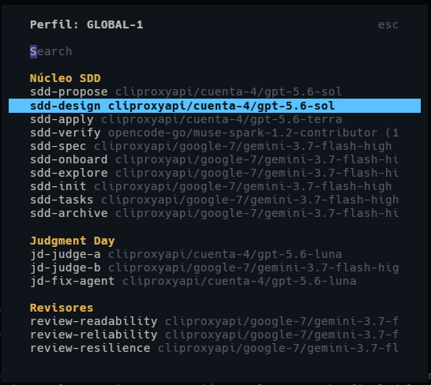
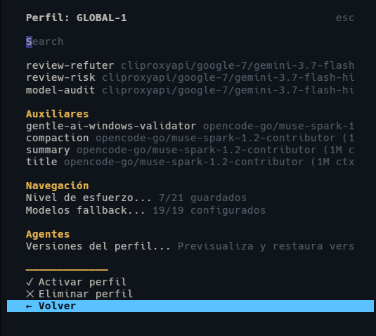
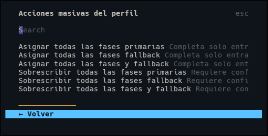
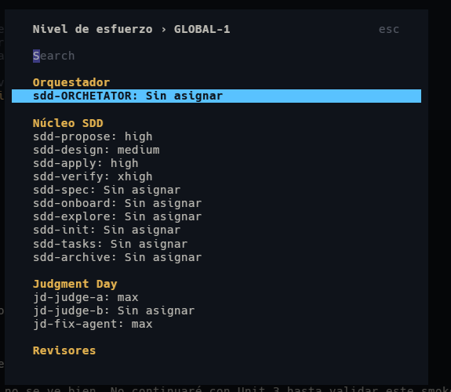

# OpenCode SDD Profile Manager


A keyboard-first OpenCode TUI plugin for creating, editing, versioning, and activating model profiles across Spec-Driven Development agents.

It provides one consistent catalog for SDD, Judgment Day, review, and auxiliary agents; grouped model navigation; per-agent reasoning effort; fallback control; profile history; and project-scoped Engram memory browsing.

> **Project lineage**
>
> This repository is an independently maintained derivative of [`j0k3r-dev-rgl/sdd-engram-plugin`](https://github.com/j0k3r-dev-rgl/sdd-engram-plugin). The original MIT copyright and license are preserved in [`LICENSE`](LICENSE). See [Origin and attribution](#origin-and-attribution).

## What it solves

OpenCode agent configurations become difficult to manage when every SDD phase uses a different model, reasoning level, or fallback. Editing those values directly in JSON is error-prone and makes it hard to answer simple questions:

- Which profile is active?
- Which model does each agent use?
- Which agents support fallback or reasoning effort?
- Can a complete configuration be changed without destroying `{file:...}` links?
- Can previous profile versions be restored?

This plugin turns that configuration into a structured TUI workflow.

## Highlights

| Capability | What it provides |
|---|---|
| Structured agent catalog | 25 ordered agents grouped as Orchestrator, SDD Core, Judgment Day, Reviewers, and Auxiliaries |
| Profile management | Create, rename, edit, activate, delete, and restore JSON profiles |
| Model navigation | Direct model selection with grouped categories and provider/model metadata |
| Reasoning effort | Per-agent `low`, `medium`, `high`, `xhigh`, or `max` configuration |
| Fallback management | Explicit fallback assignments with eligibility and synchronization safeguards |
| Bulk actions | Complete missing assignments or overwrite an entire SDD phase group |
| Active-profile state | Persistent `✓ Active` marker after activation and restart |
| Version history | Automatic profile snapshots, previews, and restoration |
| Engram browser | Read project memories from the same TUI |
| Host compatibility | Safe dialog sizing and graceful degradation across OpenTUI host capabilities |

## Screenshots

### Profile overview and grouped model navigation

<p align="center">
  
</p>

### Profile actions and active configuration

<p align="center">
  
</p>

### Bulk profile actions

<p align="center">
  
</p>

### Reasoning effort

<p align="center">
  
</p>

## Requirements

| Requirement | Supported version |
|---|---|
| Node.js | `>=24 <25` |
| OpenCode | `>=1.17.11` |
| OpenTUI | `>=0.4.2 <1` |
| SolidJS | `1.9.12` |
| Engram | Optional; required only for memory browsing |

The exact runtime compatibility contract is defined in [`package.json`](package.json).

## Installation

### Option A — local development build

Use this method to run the repository exactly as checked out.

1. Clone the repository:

   ```bash
   git clone https://github.com/RamonsDka/opencode-sdd-profile-manager.git
   cd opencode-sdd-profile-manager
   ```

2. Select Node.js 24 and install dependencies:

   ```bash
   nvm use
   npm ci
   ```

3. Build the TUI bundle:

   ```bash
   npm run build
   ```

4. Add the generated plugin to your global OpenCode TUI configuration.

   Linux/macOS: `~/.config/opencode/tui.json`

   Windows: `C:\Users\<user>\.config\opencode\tui.json`

   ```json
   {
     "$schema": "https://opencode.ai/tui.json",
     "plugin": [
       "/absolute/path/to/opencode-sdd-profile-manager/dist/tui.js"
     ]
   }
   ```

   Windows example:

   ```json
   {
     "$schema": "https://opencode.ai/tui.json",
     "plugin": [
       "C:\\projects\\opencode-sdd-profile-manager\\dist\\tui.js"
     ]
   }
   ```

5. Fully close and restart OpenCode. TUI plugins are loaded at startup and are not hot-reloaded.

6. Open the manager with `Alt+K`, `Super+K`, `:sdd-model`, or `/sdd-model`.

### Option B — npm package

The inherited package identifier is `opencode-sdd-engram-manage`. Use this option only after a compatible package release is available:

```json
{
  "$schema": "https://opencode.ai/tui.json",
  "plugin": ["opencode-sdd-engram-manage"]
}
```

OpenCode installs and caches npm plugins automatically. Restart OpenCode after changing the plugin specification.

## Quick start

1. Open the manager with `Alt+K`.
2. Choose **Manage SDD profiles**.
3. Create a profile or open an existing one.
4. Assign primary models, reasoning effort, and eligible fallback models.
5. Activate the profile.
6. Reopen the profile list and confirm the `✓ Active` marker.

Profiles are stored outside the repository:

```text
~/.config/opencode/profiles/
~/.config/opencode/profile-versions/
```

When `XDG_CONFIG_HOME` is configured, the plugin uses its `opencode` directory instead.

## Agent catalog

The visible catalog is stable and intentionally ordered:

| Category | Agents |
|---|---|
| Orchestrator | `sdd-ORCHETATOR` |
| SDD Core | `sdd-propose`, `sdd-design`, `sdd-apply`, `sdd-verify`, `sdd-spec`, `sdd-onboard`, `sdd-explore`, `sdd-init`, `sdd-tasks`, `sdd-archive` |
| Judgment Day | `jd-judge-a`, `jd-judge-b`, `jd-fix-agent` |
| Reviewers | `review-readability`, `review-reliability`, `review-resilience`, `review-validator`, `review-refuter`, `review-risk`, `model-audit` |
| Auxiliaries | `gentle-ai-windows-validator`, `compaction`, `summary`, `title` |

Category headings are visual metadata, not selectable pseudo-options.

## Profile format

A profile stores model assignments, optional fallback overrides, and compatible per-agent configuration:

```json
{
  "models": {
    "sdd-ORCHETATOR": "provider/model-id",
    "sdd-apply": "provider/model-id",
    "review-risk": "provider/model-id"
  },
  "fallback": {
    "sdd-apply": "provider/fallback-model-id"
  },
  "configs": {
    "sdd-apply": {
      "reasoningEffort": "high"
    }
  }
}
```

Profile version metadata is stored separately so profile JSON remains portable.

## Configuration

### Keyboard shortcuts

Create `~/.config/opencode/sdd-model-select.json`:

```json
{
  "shortcuts": ["alt+k", "super+k"]
}
```

### Badge preferences

The manager can show the active model or profile in the OpenCode status area. These preferences are stored through OpenCode KV state rather than inside profile JSON.

### Engram integration

Engram memory browsing is optional. When Engram is available, the TUI resolves the current project and displays recent project observations. Profile management remains usable without memory browsing.

## Architecture

```text
OpenCode TUI
    │
    ├── index.tsx              Plugin registration, shortcuts, badge, lifecycle
    │
    └── src/dialogs.tsx        TUI workflows and navigation
            │
            ├── src/catalog.ts         Ordered agent catalog and eligibility
            ├── src/profiles.ts        Profile I/O, versions, activation, fallback sync
            ├── src/profile-reasoning.ts Reasoning-effort compatibility and updates
            ├── src/orchestrator.ts    Orchestrator aliases and migration policy
            ├── src/host-compat.ts     OpenTUI capability guards and dialog sizing
            ├── src/memories.ts        Engram project-memory access
            ├── src/config.ts          Paths, shortcuts, and project resolution
            └── src/state.ts           Active profile and badge signals
```

See [`docs/architecture.md`](docs/architecture.md) for responsibilities and data flows.

## Libraries and tooling

### Runtime peers

- [`@opencode-ai/plugin`](https://www.npmjs.com/package/@opencode-ai/plugin) — OpenCode plugin contract.
- [`@opentui/core`](https://www.npmjs.com/package/@opentui/core) — terminal UI primitives.
- [`@opentui/keymap`](https://www.npmjs.com/package/@opentui/keymap) — keyboard binding support.
- [`@opentui/solid`](https://www.npmjs.com/package/@opentui/solid) — SolidJS renderer for OpenTUI.
- [`solid-js`](https://www.npmjs.com/package/solid-js) — reactive state and rendering.

### Development stack

- TypeScript 6
- Vitest 4
- tsup 8
- esbuild Solid plugin
- semantic-release

See [`docs/dependencies.md`](docs/dependencies.md) for the dependency roles and version policy.

```text
Bulk actions
──────────────────────────────────────────────────
Set
  Set all primary phases
  Set all fallback phases
  Set all phases and fallbacks

Override
  Override all primary phases        requires confirmation
  Override all fallback phases       requires confirmation
  Override all phases and fallbacks  requires confirmation
```

```text
Profile versions: team-default
──────────────────────────────────────────────────
When                  Bulk                         Phase
2026-04-26 14:08      Set all fallback phases      all fallback phases
2026-04-26 13:52      Override all primary phases  all primary phases
2026-04-26 13:10      Manual edit                  sdd-apply
```

```text
Preview version 2026-04-26 14:08
──────────────────────────────────────────────────
models.sdd-apply      openai/gpt-5.5
fallback.sdd-apply    google/gemini-flash-2.0

[Restore this version]  [Back]
Restore? This replaces the current profile file.
```

### Profile Versions

Use **Profile versions...** from the profile detail screen to review saved profile snapshots.

- Versions are created automatically before bulk profile actions.
- Versions are also created automatically before individual primary or fallback phase model changes.
- Profile versions use one unified history for bulk actions and individual phase changes, retaining the latest 60 snapshots per profile.
- Each version can be previewed before restoring it.
- Restore writes the selected snapshot back to the profile file.

Version history is stored outside the profile JSON under `~/.config/opencode/profile-versions/`, or `$XDG_CONFIG_HOME/opencode/profile-versions/` when configured. The profile JSON itself only contains model data (`models` and `fallback`); version metadata is kept out of the main profile file.

---

## Screenshots

Visual walkthrough of profile management, model assignments, bulk actions, and reasoning effort:

### Profile Management & Active Status

<p align="center">
  
</p>

### Model & Fallback Assignment

<p align="center">
  
</p>

### Bulk Profile Actions

<p align="center">
  
</p>

### Reasoning Effort Configuration

<p align="center">
  
</p>

---

## Orchestrator Fallback Policy Script

This repo includes a script to ensure the `sdd-orchestrator` prompt contains the fallback policy block required for managed `*-fallback` agents to work correctly when a primary sub-agent fails.

- **Script:** `scripts/ensure-orchestrator-fallback-policy.ts`
- **Supports:** Inline prompt text in `opencode.json` and external `{file:...}` references.

```bash
# Check mode (no changes)
npm run orchestrator:fallback:check

# Apply changes
npm run orchestrator:fallback:apply

# Custom config path
node ./scripts/ensure-orchestrator-fallback-policy.ts --config /path/to/opencode.json
```

---

## Example Fixtures & Smoke Validation

Under `examples/`:

- `opencode-inline.json` — inline orchestrator prompt config
- `opencode-external.json` + `sdd-orchestrator-example.md` — external prompt file config
- `profiles/*.json` — profile payloads in new and legacy formats

Run smoke validation:

```bash
npm run examples
```

Validates:
1. Fallback policy injection for inline and external prompt configs.
2. Profile fixture readability for new (`models` + `fallback`) and legacy formats.

---

## Development

```bash
npm ci
npm run typecheck
npm test
npm run build
```

Focused commands:

```bash
npm test -- src/catalog.test.ts
npm test -- src/dialogs.test.ts
npm test -- src/profiles.test.ts
npm test -- src/profile-reasoning.test.ts
npm test -- src/host-compat.test.ts
npm run test:coverage
npm run examples
```

Current verified baseline at repository creation:

```text
Typecheck: passed
Test files: 12 passed
Tests: 364 passed
Build: dist/tui.js generated successfully
```

## Documentation

| Document | Purpose |
|---|---|
| [`docs/installation.md`](docs/installation.md) | Installation, local loading, updates, and removal |
| [`docs/usage.md`](docs/usage.md) | Profile workflow, agent catalog, effort, fallback, and versions |
| [`docs/architecture.md`](docs/architecture.md) | Module boundaries and runtime data flow |
| [`docs/dependencies.md`](docs/dependencies.md) | Runtime peers, development tooling, and version policy |
| [`docs/testing.md`](docs/testing.md) | Test layers, validation commands, and manual smoke tests |
| [`docs/troubleshooting.md`](docs/troubleshooting.md) | Plugin loading, shortcuts, paths, and activation issues |
| [`docs/compatibility.md`](docs/compatibility.md) | Host APIs and graceful degradation |
| [`docs/dialogs.md`](docs/dialogs.md) | Dialog sizing and UX tiers |
| [`docs/profile-reasoning-effort.md`](docs/profile-reasoning-effort.md) | Reasoning-effort behavior and compatibility |

## Origin and attribution

This codebase derives from:

- Original repository: [`j0k3r-dev-rgl/sdd-engram-plugin`](https://github.com/j0k3r-dev-rgl/sdd-engram-plugin)
- Original package: [`opencode-sdd-engram-manage`](https://www.npmjs.com/package/opencode-sdd-engram-manage)
- Original author/license holder: `j0k3r-dev-rgl`
- License: MIT

This repository preserves the original MIT notice and documents the derivative work rather than presenting it as an unrelated clean-room implementation.

## Contributing

Read [`CONTRIBUTING.md`](CONTRIBUTING.md). Every pull request must link a GitHub issue, remain focused, and include tests or validation notes.

## Security

Do not include API keys, provider credentials, personal profile files, or global OpenCode configuration in issues or pull requests. See [`SECURITY.md`](SECURITY.md) for reporting guidance.

## License

MIT. See [`LICENSE`](LICENSE).
