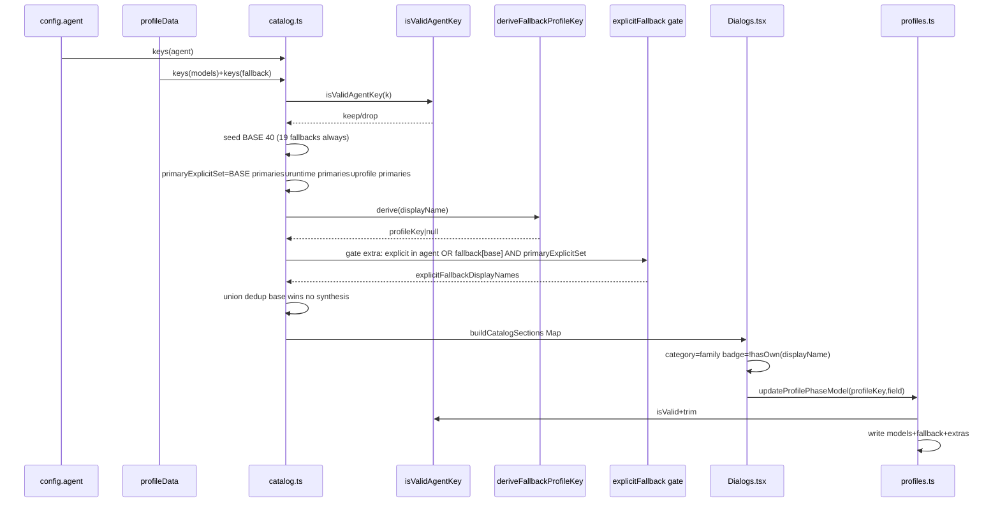
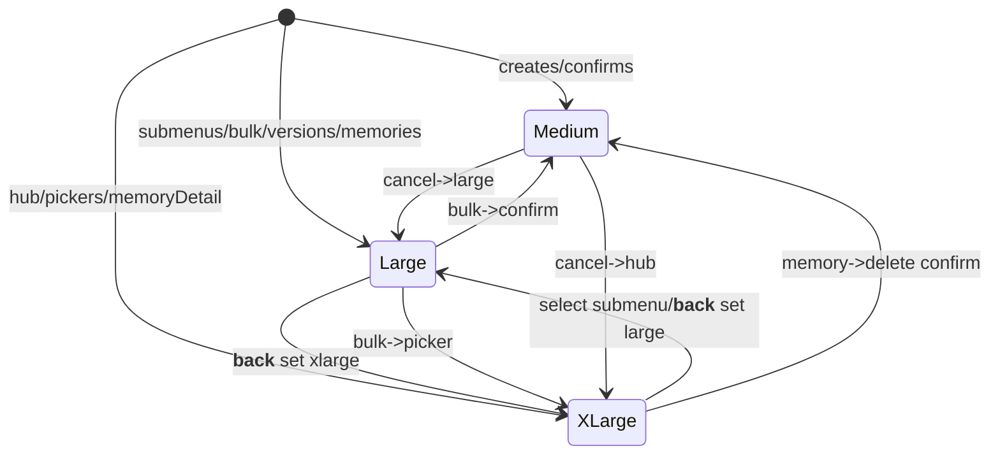

# Design: Gentle AI Agent Parity and Dialog Sizing

## 1. Context / Current Architecture and Constraints

**Stack:** TS6 Node24 ESM SolidJS1.9 OpenTUI0.4.2 tsup vitest4.1 TDD strict.

**Plugin:** `opencode-sdd-engram-manage` via `api.ui.dialog`. State `config.agent`, `profiles/*.json`+`profile-versions/`, Engram. Hosts may lack `setSize`.

**Discovery (`src/utils.ts`):**
```ts
const MANAGED_AGENT_PREFIXES=["sdd-","review-","jd-"];
const MANAGED_SDD_AGENT_EXCEPTIONS=new Set(["gentle-orchestrator"]);
const FALLBACK_INELIGIBLE_AGENTS=new Set(["sdd-orchestrator","gentle-orchestrator"]);
isManaged=prefix||exception; isPrimary=isManaged&&!endsWith("-fallback"); isFallbackEligible=isPrimary&&!FALLBACK_INELIGIBLE
```
`model-audit` filtered (no prefix). 21 primaries partially discovered; 19 fallbacks only if in `config.agent`.

**Profiles (`src/profiles.ts`):** gates on `isPrimary`/`isFallbackEligible` drop `models["my-agent"]`. `extractPersistedProfileExtras` scans top-level not `models|fallback|configs|agent` and not `isPrimary|isFallback`. Helper excludes containers.

**Dialogs:** All `medium`. `buildProfileDetailAgentSections` uses `Object.keys(agent).filter(isPrimary).sort()` — no base/hybrid, alpha not TUI. `showMemoryDetail` `wrap(line,52)` truncates. No `safeSetDialogSize`.

**Constraints:** 40 parity TUI order, hybrid no loss, families no bulk, `model-audit` no fallback, persisted-vs-managed, `hasOwn` badge, size isolation, host clamp, anti-pollution, no global mutation, extensible future fallbacks without synthesis.

## 2. Goals and Non-Goals

**Goals:**
- G1 — 40 base (21+19) always in canonical TUI order + deterministic extras.
- G2 — Hybrid: `BASE_CANONICAL_ORDER` (40) ∪ eligible runtime/profile keys after `isValidAgentKey`, dedup, base wins, extensible fallback union.
- G3 — Fallback: 19 base always managed + future explicit when conditions met; `sdd-apply-fallback` display ↔ `fallback["sdd-apply"]` storage; badge on `displayName`, desc on `profileKey`; `model-audit-fallback` never; mere `sdd-future` must NOT synthesize fallback.
- G4 — Two-layer profile: persisted keeps any `isValidAgentKey` custom; managed filters eligibility + explicit-fallback rule.
- G5 — Tiered isolated guarded sizing (`xlarge`/`large`/`medium`) with `≥80` wrap at `xlarge` lossless.
- G6 — Strict TDD: every invariant has RED/GREEN; five normative future REDs added.
- G7 — Compat: old profiles/BOM/extras preserved; old hosts degrade; future `sdd-future`/`sdd-future-fallback` forward-compatible when explicit.

**Non-Goals:**
NG1 bulk per-family; NG2 global install/`external-agent` mutation; NG3 synthesize `model-audit-fallback` or fallback from primary alone; NG4 alpha reorder; NG5 custom overflow for narrow; NG6 new storage schema (wire `ProfileData {models,fallback?,configs?,...extras}`).

## 3. Technical Approach and Architecture Decisions

**Approach:** `src/catalog.ts` SSOT for 40 base/validation/families. Gate persisted I/O on `isValidAgentKey`. Managed view distinguishes explicit fallback candidates from synthesis. `CatalogEntry` with real `category`. `safeSetDialogSize` per screen + reset.

### Decisions

| Decision | Options | Tradeoff | Choice | Rationale |
|---|---|---|---|---|
| Agent source | Pure dynamic / Pure static / Hybrid | Dynamic omits base; static blocks future `sdd-*` | **Hybrid + `isValidAgentKey` + `BASE_CANONICAL_ORDER`** | 40 always visible, extensible; proposal Approach 3; TDD seam union/dedup/base-wins |
| Persisted vs managed | Single map / Split | Single drops `my-agent` or leaks ineligible | **Split: persisted `isValidAgentKey`+non-empty; managed `isPrimary`/`derive`+explicit gate** | Lossless `my-agent`, `sdd-future`; managed 19+explicit correct, bulk ok |
| Catalog ownership | Dialog helpers / `catalog.ts` | Dialogs couple truth to UI | **`catalog.ts` central** | Single boundary, testable, reused |
| `displayName` vs `profileKey` | Single / Split triple | Single conflates label and `fallback[profileKey]` | **Split `CatalogEntry{displayName,profileKey,field}`** | `sdd-apply-fallback`→`field=fallback,profileKey=sdd-apply`; same for `sdd-future-fallback` |
| Fallback derivation | Strip any `-fallback` / Conditional+BASE | BASE gate blocks `sdd-future-fallback`; blind synthesizes `model-audit-fallback` | **`derive(displayName)`: validate+strip one `-fallback`+`isValid(primary)`+`isFallbackEligible(primary)` NO `BASE.includes`** | Extensible union: 19 base via seed, future explicit via derive; rejects `model-audit-fallback`, weird, invalid |
| Explicit fallback gate | Synthesize on any primary / Only explicit | Synthesis inflates on mere `sdd-future` | **Explicit-only: extra fallback iff (a) displayName explicit in `config.agent` OR explicit `profile.fallback[base]` AND (b) primary explicit in `BASE`∪runtime∪profile and `isFallbackEligible`** | Prevents synthesis; enables pairs, blocks weird/model-audit |
| Nested custom preserve | `extractPersistedProfileExtras` keep nested / Maps | Helper excludes `models`/`fallback` containers | **Maps via `isValidAgentKey`; helper top-level only** | Fixes `models.my-agent` preservation |
| `model-audit` | Prefix hack / Exception | Prefix pollutes SDD | **Add to `MANAGED_SDD_AGENT_EXCEPTIONS`+`FALLBACK_INELIGIBLE`** | Family Tools, no fallback, `FALLBACK_INELIGIBLE={sdd-orchestrator,gentle-orchestrator,model-audit}` |
| Sizing | Global `large` / Tiered per screen | Global wastes confirms | **Tiered `safeSetDialogSize` per entry+`__back__` reset** | `xlarge` hub/pickers/memory, `large` submenus, `medium` confirms |
| Guard & wrap | Inline `try/catch` / hard 52 | Duplicates, clips | **`safeSetDialogSize`+`wrapDisplayText(value,max)` 52/≥80** | One guarded path; `≥80` at `xlarge` |

Invariants: `hasOwn(config.agent,displayName)` badge covers base+explicit future. 19 base seeded; extras only when explicit. No bulk, no global mutation, guard never throws.

## 4. Complete Data Model + Algorithms / Invariants

### 4.1 Types

```ts
export type DialogSize="medium"|"large"|"xlarge";
export type AgentFamily="Orchestrator"|"SDD"|"JD"|"Review"|"Tools"|"Fallbacks"|"Custom";
export type AssignmentField="model"|"fallback";
export type CatalogEntry={
  displayName:string; // e.g. "sdd-apply-fallback" or "sdd-future-fallback"
  profileKey:string;  // e.g. "sdd-apply" or "sdd-future"
  field:AssignmentField;
  family:AgentFamily;
  base:boolean; // in BASE_CANONICAL_ORDER
  isFallback:boolean; // via derive
  orderIndex:number;
};
export const BASE_CANONICAL_ORDER:readonly string[]=[
  "gentle-orchestrator","sdd-init","sdd-explore","sdd-propose","sdd-spec","sdd-design","sdd-tasks",
  "sdd-apply","sdd-verify","sdd-archive","sdd-onboard","jd-judge-a","jd-judge-b","jd-fix-agent",
  "review-risk","review-readability","review-reliability","review-resilience","review-refuter",
  "review-validator","model-audit",
  "jd-fix-agent-fallback","jd-judge-a-fallback","jd-judge-b-fallback",
  "review-readability-fallback","review-refuter-fallback","review-reliability-fallback",
  "review-resilience-fallback","review-risk-fallback","review-validator-fallback",
  "sdd-apply-fallback","sdd-archive-fallback","sdd-design-fallback","sdd-explore-fallback",
  "sdd-init-fallback","sdd-onboard-fallback","sdd-propose-fallback","sdd-spec-fallback",
  "sdd-tasks-fallback","sdd-verify-fallback",
];
```
`ProfileData` stays `{models:ProfileModels;fallback?:ProfileFallbackModels;configs?:ProfileConfigs;[extra:string]:unknown}`.

### 4.2 Validator

```ts
export function isValidAgentKey(k:unknown):boolean{
  if(typeof k!=="string")return false;
  if(k.length<1||k.length>64)return false;
  if(k==="__proto__"||k==="constructor"||k==="prototype")return false;
  if(!/^[a-zA-Z0-9][a-zA-Z0-9._-]*$/.test(k))return false;
  return true;
}
```
Values `typeof string&&trim().length>0`. Badge uses `hasOwn`, not `in`.

### 4.3 Family & Fallback Derivation

```ts
export function deriveFallbackProfileKey(displayName:string):string|null{
  if(typeof displayName!=="string")return null;
  if(!isValidAgentKey(displayName))return null;
  if(!displayName.endsWith("-fallback"))return null;
  const primary=displayName.slice(0,-9);
  if(!isValidAgentKey(primary))return null;
  if(!isFallbackEligibleSddAgent(primary))return null;
  return primary;
}
export function classifyFamily(e:{displayName:string;isFallback:boolean;base:boolean}):AgentFamily{
  if(e.displayName==="gentle-orchestrator")return "Orchestrator";
  if(e.isFallback)return "Fallbacks";
  if(e.displayName==="model-audit")return "Tools";
  if(e.displayName.startsWith("sdd-"))return "SDD";
  if(e.displayName.startsWith("jd-"))return "JD";
  if(e.displayName.startsWith("review-"))return "Review";
  return "Custom";
}
```
No `BASE.includes` check — gate is in `buildCatalogSections`. `derive` correctly returns `"sdd-future"` for `"sdd-future-fallback"` and `null` for `"model-audit-fallback"`, `"weird-fallback"`, double suffix.

### 4.4 Catalog Build Algorithm — Extensible Explicit-Fallback Union

```ts
export function buildCatalogSections(config:any,profileData:ProfileData):Map<AgentFamily,CatalogEntry[]>{
  const runtimeKeys=Object.keys(config?.agent??{});
  const profileModelKeys=Object.keys(profileData?.models??{});
  const profileFallbackPrimaryKeys=Object.keys(profileData?.fallback??{}).filter(isValidAgentKey);
  const validRuntimeKeys=runtimeKeys.filter(isValidAgentKey);
  const validProfileModelKeys=profileModelKeys.filter(isValidAgentKey);
  const basePrimarySet=new Set((BASE_CANONICAL_ORDER as readonly string[]).filter(n=>deriveFallbackProfileKey(n)===null));
  const runtimePrimarySet=new Set(validRuntimeKeys.filter(n=>isPrimarySddAgent(n)));
  const profilePrimarySet=new Set(validProfileModelKeys.filter(n=>isPrimarySddAgent(n)));
  const primaryExplicitSet=new Set<string>([...basePrimarySet,...runtimePrimarySet,...profilePrimarySet]);
  const explicitFallbackDisplayNames=new Set<string>();
  for(const name of validRuntimeKeys){
    const d=deriveFallbackProfileKey(name); if(d===null)continue;
    if(!primaryExplicitSet.has(d))continue;
    explicitFallbackDisplayNames.add(name);
  }
  for(const primary of profileFallbackPrimaryKeys){
    if(!isFallbackEligibleSddAgent(primary))continue;
    if(!primaryExplicitSet.has(primary))continue;
    const dn=`${primary}-fallback`; if(!isValidAgentKey(dn))continue;
    if(deriveFallbackProfileKey(dn)===null)continue;
    explicitFallbackDisplayNames.add(dn);
  }
  const candidateNames=new Set<string>([...BASE_CANONICAL_ORDER,...validRuntimeKeys,...validProfileModelKeys,...explicitFallbackDisplayNames]);
  const entries:CatalogEntry[]=[...candidateNames].map(name=>{
    const base=(BASE_CANONICAL_ORDER as readonly string[]).includes(name);
    const derived=deriveFallbackProfileKey(name);
    const isFallback=derived!==null&&(base||explicitFallbackDisplayNames.has(name));
    const profileKey=isFallback?derived!:name;
    const field: AssignmentField = isFallback ? "fallback" : "model";
    const family=classifyFamily({displayName:name,isFallback,base});
    const orderIndex=base?BASE_CANONICAL_ORDER.indexOf(name):Number.POSITIVE_INFINITY;
    return {displayName:name,profileKey,field,family,base,isFallback,orderIndex};
  });
  const order:AgentFamily[]=["Orchestrator","SDD","JD","Review","Tools","Fallbacks","Custom"];
  const map=new Map<AgentFamily,CatalogEntry[]>(); for(const f of order)map.set(f,[]);
  for(const e of entries)map.get(e.family)!.push(e);
  for(const f of order){ const b=map.get(f)!; b.sort((a,b)=>a.base!==b.base?a.base?-1:1:a.base&&b.base?a.orderIndex-b.orderIndex:a.displayName.localeCompare(b.displayName));}
  return map;
}
```

**Normative examples:**
- Runtime `{sdd-future,sdd-future-fallback}` → `sdd-future` SDD `base:false isFallback:false field:model`, `sdd-future-fallback` Fallbacks `base:false isFallback:true field:fallback profileKey:"sdd-future"` storage `fallback["sdd-future"]`.
- Runtime `{sdd-future}` alone → only primary; no fallback synthesized.
- Profile `{models:{"sdd-future":"p/m"},fallback:{"sdd-future":"p/m2"}}` → both managed via explicit `profile.fallback`.
- `weird-fallback` without eligible base → `derive===null` → `isFallback:false` → Custom or preserved-not-managed; never Fallbacks.
- `model-audit-fallback` → `derive===null` (ineligible) → never managed/synthesized.

Persisted pseudocode: `normalizeProfileModels` via `isValidAgentKey`; `extractSddFallbackModels` same; `readProfileDataFromRaw` BOM→parse→branch models/legacy/config via `isValidAgentKey`; `extractPersistedProfileExtras` keeps top-level not `models|fallback|configs|agent` and not `isPrimary|isFallback`.

### 4.5 Invariants

- I1 Base 40 always via seed.
- I2 Union/dedup/base-wins: `BASE ∪ isValid(runtime) ∪ isValid(models) ∪ explicitFallbackDisplayNames` dedup, base wins.
- I3 Canonical order: base per `BASE` index, extras alpha after base per family.
- I4 Fallback 19 base always + extensible: `BASE.filter(derive!==null)===19`; extra managed iff explicit in `config.agent` OR explicit `profile.fallback[base]` AND primary explicit in `BASE`∪runtime∪profile and `isFallbackEligible`; never `model-audit-fallback`; mere primary never synthesizes.
- I5 Triple: primary `displayName==profileKey field model→models`; fallback `sdd-apply-fallback→profileKey sdd-apply field fallback→fallback[sdd-apply]` and `sdd-future-fallback→sdd-future→fallback["sdd-future"]`.
- I6 Lossless: `isValid&&trim` survives inc. `my-agent`, `sdd-future`/`fallback["sdd-future"]`.
- I7 Ineligible preserved `fallback["my-agent"]` but `isFallback false`; `weird`/`model-audit-fallback` not Fallbacks.
- I8 Badge: `base&&!hasOwn(displayName)` and explicit future `explicitFallbackDisplayNames.has(displayName)&&!hasOwn`.
- I9 Desc: fallback via `fallback[profileKey]`, primary via `models[displayName]`.
- I10 No leak: `extractPersistedProfileExtras` top-level only.
- I11 Size isolation per entry+`__back__` reset.
- I12 Guard never throws.
- I13 No synthesis: only `sdd-future` must not contain `sdd-future-fallback`.

## 5. UI Rendering and Navigation Strategy (Real `DialogSelect.category`)

Families map to `DialogSelect.option.category`. Four layers.

### 5.1 Profile Detail Hub (`showProfileDetail` — `xlarge`)

`buildProfileDetailHubOptions`: `"Profile"`→`? Name`, `"Model Navigation"`→`Bulk actions...`, `Reasoning effort...`, `Fallback models...` (count=19+explicit), `"Agents"`→`Profile versions...`, `NAV_CATEGORY`→`V Activate`, `? Delete`, `Back`. Submenus `"Reasoning (PRIMARY SDD only)"`, `"Fallback Models"`, `"Primary Models"`.

### 5.2 Submenus (`large`) — consume `CatalogEntry`

```ts
buildPrimaryModelSubmenuOptions(data,sections,api): title=displayName value=`model:${profileKey}` desc=resolveModelInfo(models[profileKey])||"Unassigned" category=family
buildFallbackSubmenuOptions: title=displayName (e.g. sdd-apply-fallback or sdd-future-fallback) value=`fallback:${profileKey}` desc=fallback[profileKey]?resolveModelInfo: "Inherited" category="Fallback Models" badge=!hasOwn(agent,displayName)?"Unconfigured":undef
buildReasoningSubmenuOptions: title=`${profileKey} reasoning effort` value=`reasoning:${profileKey}` desc=configs[profileKey]?.reasoningEffort??"Unset" category="Reasoning (PRIMARY SDD only)"
```
Future explicit fallbacks appear under `Fallbacks` after 19 base alphabetically (`base:true` first).

### 5.3 Selection → Storage

```ts
resolveProfileDetailSelectionAction(v): "model:sdd-apply"→{action:"model",agent:"sdd-apply"} "fallback:sdd-apply"→{action:"fallback",agent:"sdd-apply"} "fallback:sdd-future"→{action:"fallback",agent:"sdd-future"}
updateProfilePhaseModel(path,agent,field,modelId): field fallback iff derive(agent+"-fallback")!==null else primary via isValidAgentKey
```
Future pair writes `fallback["sdd-future"]`.

Navigation `resolveProfileDetailNavigationAction` recognizes `__submenu_primary__/__submenu_reasoning__/__submenu_fallback__`, `__back__`, `model:`, `fallback:`, `reasoning:`.

### 5.4 Navigation Reset

Every `onSelect`/`onCancel` calls `safeSetDialogSize` for target size before `dialog.replace`. `__back__` from `large` submenu calls `safeSetDialogSize(api,"xlarge")` before hub; memory detail `onCancel`→`showProjectMemoriesMenu` at `large`.

## 6. Dialog Sizing Matrix

| Screen | Tier | `safeSetDialogSize` | Trigger | Reset on |
|---|---|---|---|
| Profile Detail Hub `showProfileDetail` | **xlarge** | `"xlarge"` | Entry | `__back__`→caller tier; hub sets `xlarge` |
| Model Picker `showModelPickerForAgent` | **xlarge** | `"xlarge"` | Entry | `onCancel`→`large` submenu |
| Bulk Picker `showModelPickerForBulkProfilePhases` | **xlarge** | `"xlarge"` | Entry | `onCancel`→bulk `large` |
| Memory Detail `showMemoryDetail` | **xlarge** | `"xlarge"` | Entry `wrap(80)` | `onCancel`→`showProjectMemoriesMenu` `large`; `__delete__`→`medium` |
| Primary Submenu | **large** | `"large"` | Entry | `__back__`→hub `xlarge` |
| Reasoning Submenu | **large** | `"large"` | Entry | `__back__`→hub |
| Fallback Submenu | **large** | `"large"` | Entry | `__back__`→hub |
| Bulk Actions Menu | **large** | `"large"` | Entry | Select→picker `xlarge` or confirm `medium`; `__back__`→hub |
| Provider picker | **large** | `"large"` | Entry | `onCancel` caller tier |
| Profile Versions List/Preview | **large** | `"large"` | Entry | `__back__`→hub |
| Project Memories Menu | **large** | `"large"` | Entry | `onSelect`→memory `xlarge`; `__back__`→profiles `medium` |
| Create/Rename/Delete/Confirm Bulk/Restore/Activate/Delete-Memory | **medium** | `"medium"` | Entry | — |
| Project list / compact | **medium** | `"medium"` | Entry | — |

Every screen unconditionally calls `safeSetDialogSize` before `replace`. Rapid 5× back/forth keeps size. `wrapDisplayText` adaptive `≥80` at `xlarge` else `52`.

## 7. Diagrams

### 7.1 Catalog / Assignment Sequence



### 7.2 Dialog-Size Navigation State



## 8. File / Module Ownership and Exact Interfaces

| File | Action | Ownership | Interface |
|---|---|---|---|
| `src/catalog.ts` | **Create** | 40 base, `isValidAgentKey`, `derive` (no BASE gate), `classifyFamily`, `buildCatalogSections` explicit gate | `BASE_CANONICAL_ORDER:readonly string[]; isValidAgentKey(k:unknown):boolean; deriveFallbackProfileKey(s:string):string|null; classifyFamily(e):AgentFamily; buildCatalogSections(config,profileData):Map<AgentFamily,CatalogEntry[]>; FALLBACK_MANAGED_COUNT=19` |
| `src/types.ts` | **Modify** | Shared types | `DialogSize`, `AgentFamily`, `CatalogEntry{displayName,profileKey,field,family,base,isFallback,orderIndex}` |
| `src/utils.ts` | **Modify** | Eligibility | Add `model-audit` to `MANAGED_SDD_AGENT_EXCEPTIONS`+`FALLBACK_INELIGIBLE`; `isManaged`/`isPrimary`/`isSddFallback`/`isFallbackEligible` unchanged signature |
| `src/profiles.ts` | **Modify** | Persisted vs managed, I/O, bulk, activation | Persisted via `isValidAgentKey`; `normalizeProfileModels`, `extractSddFallbackModels`, `readProfileDataFromRaw`, `extractPersistedProfileExtras` top-level, `normalizePersistedProfileData`, `writeProfileData`, `getManagedSddPrimaryNames`, `getManagedFallbackNames` (19+explicit), `updateProfilePhaseModel` via `derive`, bulk managed only, activation only present keys |
| `src/dialogs.tsx` | **Modify** | UI sections, sizing, badge/desc | Consumes `CatalogEntry`; `buildProfileDetailHubOptions`, `buildPrimaryModelSubmenuOptions`, `buildFallbackSubmenuOptions` (19+explicit), `buildReasoningSubmenuOptions`; every `show*` calls `safeSetDialogSize`; `wrapDisplayText` ≥80 at xlarge; badge `hasOwn(displayName)` |
| `src/host-compat.ts` | **Modify** | Guard | `safeSetDialogSize(api,size){try{api?.ui?.dialog?.setSize?.(size)}catch(e){log.warn}}` never throws |
| `src/orchestrator.ts` | **No change** | `getOrchestratorPolicy`, `canonicalize` | Existing aliasing |
| `docs/*` | **Modify** | Guides | Persisted-vs-managed+explicit rule; tier table; compat matrix; changelog 1.7.0 feat `model-audit`+explicit future pairs |

`src/catalog.ts` ≤160 lines; no framework folder.

## 9. Compatibility & Migration (including Explicit Future Fallbacks)

**Wire compat:** No schema break. File `ProfileData`. BOM strip, parse fail→`{models:{}}`, unknown top-level preserved.

**Persisted vs managed:**

| Layer | Where | Filter | Examples |
|---|---|---|---|
| **Persisted** | `normalizeProfileModels`, `extractSddFallbackModels`, `writeProfileData` | `isValid&&trim` any valid key | `models["my-agent"]`, `models["sdd-future"]`, `fallback["sdd-future"]`, `fallback["my-agent"]` survive |
| **Managed** | `buildCatalogSections`, `getManaged*`, `sync*`, `update*`, bulk | `isPrimary`/`derive!=null`+explicit gate | `my-agent`→Custom not synced; `sdd-future`→SDD when explicit; `sdd-future-fallback`→Fallbacks only when explicit+primary explicit+eligible |

**Future normative:**
- `config.agent={sdd-future,sdd-future-fallback}` → SDD + Fallbacks, storage `fallback["sdd-future"]`.
- `config.agent={sdd-future}` alone → only primary, no fallback.
- `profile={models:{"sdd-future":"p/m"},fallback:{"sdd-future":"p/m2"}}` → fallback explicit via `profile.fallback` managed (needs primary explicit via `models`).
- `weird-fallback` ineligible → never Fallbacks; runtime→Custom, profile preserved-not-managed.
- `model-audit-fallback` → never managed even if present.

**Activation:** writes only present `models`/`fallback` with `isValid`+`derive!=null` (eligibility) + explicit gate for future (19 base always eligible). `sdd-future`+`sdd-future-fallback` both when both present.

**Host compat:** No `setSize`→no-op `?.`; throw→caught `log.warn`; <80 cols host clamps.

**Migration:** Zero-config auto-migration on next write; no flag. Old without `model-audit` loads unchanged; base guarantees `model-audit` appears. Future `sdd-future`/`fallback["sdd-future"]` become managed on next build without migration. Auto-chain PRs; revert slice revert.

## 10. Error Handling & Observability

| Failure | Detection | Handling | Observable |
|---|---|---|---|
| Corrupt JSON/BOM | `JSON.parse` throws | Return `{models:{}}`; WARN log | No crash, base 40 |
| `__proto__`/invalid | `isValid` false | Dropped silently | debug optional |
| Missing `api.ui.dialog`/`setSize` | `?.` undefined | `safeSetDialogSize` no-op | No exception |
| `setSize` throws | `try/catch` | Swallowed | `log.warn` |
| `update` fallback ineligible (`model-audit`, `weird`) | `derive===null` | Reject throw or `{changed:false}` | toast error |
| Future fallback primary not explicit | `primaryExplicitSet` gate fail but `derive` pass | Persisted but not managed until primary explicit | Not cataloged |
| I/O `ENOENT`/perm | `hasErrorCode("ENOENT")` | read→`{}`, write→`CONFIG_UPDATE_ERROR_MESSAGE` | toast |
| Activation fails | `formatConfigUpdateError` | `CONFIG_UPDATE_ERROR_MESSAGE: ...` | toast error |

`atomicWriteFile` prevents torn writes.

## 11. Security / Privacy / No-Global-Mutation

- **Pollution:** `isValid` blocks `__proto__`+regex; `hasOwn` not `in`; no `Object.assign` raw.
- **No shell/VCS:** no `execFile`/`spawn`/`git`.
- **Atomic:** `atomicWriteFile` JSON.
- **Canonicalize:** only `sdd-orchestrator`↔`gentle-orchestrator`.
- **No global mutation:** activate/bulk only present keys.
- **No synthesis:** `sdd-future` alone never creates fallback; explicit gate prevents shadow writes.
- **Privacy:** only `provider/model` strings.

**Threat Matrix:** `N/A — no routing, shell, subprocess, VCS/PR automation, executable-file classification, or process-integration boundary.` Future shell would require matrix.

## 12. Complete Strict TDD Strategy

Runner `vitest run` (unit+integration), typecheck `npm run typecheck`, coverage `vitest run --coverage`. No e2e. TDD RED→GREEN→triangulation→REVIEW.

### 12.1 Seam Ownership

| Seam | Owner | Contract |
|---|---|---|
| Catalog validation/dedup/order/explicit | `src/catalog.test.ts`+`src/utils.test.ts` | `isValidAgentKey`, `derive`, `buildCatalogSections` incl. 5 normative |
| Profile persisted+extras+future | `src/profiles.test.ts` | `normalizeProfileModels`, `extractSddFallbackModels`, `readProfileDataFromRaw`, `extractPersistedProfileExtras`, `writeProfileData`, `updateProfilePhaseModel`, bulk, activation, `fallback["sdd-future"]` |
| Dialogs badge/desc/sizing/guard/future triple | `src/dialogs.test.ts`+`src/host-compat.test.ts` | `buildPrimary/FallbackSubmenuOptions`, `show*` size, `wrapDisplayText`, future pair split |
| Orchestrator aliasing | `src/orchestrator.test.ts` | `canonicalizeProfileModels` |

No file-per-case; one cohesive per owner.

### 12.2 Explicit RED/GREEN Cases

Every row distinct; no `prior suite`. T01–T31 preserved; T32–T36 added.

| ID | Contract | RED | GREEN |
|---|---|---|---|
| T01 | **Base 40 always** | empty `config.agent`+`{}`→size40 every BASE present | seed `BASE` before union |
| T02 | **Union/dedup/base-wins** | `sdd-future`+`my-agent`+`sdd-init`→42, dedup, base attrs win | Set union `isValid`+dedup |
| T03 | **Invalid keys** | `__proto__` dropped | `isValid` |
| T04 | **Custom models.my-agent** | raw `{"models":{"my-agent":"p/m"}}` retains | `isValid` not `isPrimary` |
| T05 | **Custom fallback.my-agent** | raw `{"fallback":{"my-agent":"p/m"}}` retains | `isValid` |
| T06 | **Top-level extras+ nested** | `foo/bar`+nested `my-agent` both preserved | extras top+maps |
| T07 | **extractPersistedProfileExtras top-level only** | `models.my-agent`+top `my-agent`→result no `models`, has top `my-agent` only if top-level | filter `models|fallback|configs|agent` |
| T08 | **Ineligible fallback preserved** | `fallback:{"my-agent":"p/m"}` retains but no Fallbacks, isFallback false | `derive("my-agent-fallback")===null` |
| T09 | **Ineligible never synthesized** | `models:{"my-agent":"p/m"}` sync→fallback absent | sync 19+explicit only |
| T10 | **HasOwn primary** | `Object.create({sdd-spec})`→!hasOwn→Unconfigured | `hasOwn(displayName)` |
| T11 | **HasOwn fallback** | missing `sdd-spec-fallback`→badge via `hasOwn(displayName)` | displayName not profileKey |
| T12 | **Canonical order** | 40+extras→Orchestrator,SDD(base+alpha),JD,Review,Tools,Fallbacks(19),Custom | sort base index then alpha |
| T13 | **Fallback 19 order** | 40→Fallbacks seq jd-fix,a/b,review*5,sdd*10 | `BASE.filter(derive)` |
| T14 | **model-audit primacy** | `model-audit` isManaged&&isPrimary true | add to exception set |
| T15 | **model-audit fallback ineligible** | `isFallbackEligible("model-audit")===false` derive null sync never creates | add to FALLBACK_INELIGIBLE+derive check |
| T16 | **19 fallback mappings exact** | derive each base fallback returns primary size19 no dup | hardcoded base+derive |
| T17 | **Fallback triple** | pick `fallback:sdd-apply`→writes `fallback["sdd-apply"]` field fallback | store profileKey not displayName |
| T18 | **Fallback desc vs badge** | `sdd-apply-fallback` desc from profileKey badge from hasOwn(displayName) | two lookups |
| T19 | **Unconfigured primary assignable** | `sdd-spec` Unconfigured→pick writes | no gate blocks |
| T20 | **Unconfigured fallback assignable** | `sdd-spec-fallback`→pick writes | derive check |
| T21 | **Bulk ignores custom** | `sdd-init,my-agent` bulk fill→my-agent unchanged | bulk managed only |
| T22 | **Activation preserves external** | global `external-agent` without profile→unchanged after activate | writes only present keys |
| T23 | **Single suffix** | `sdd-apply-fallback-fallback`→null | slice once+eligible false |
| T24 | **isValid bounds** | `0,1,64,65,"0a","a/b","a b"`→false except 1..64 alnum-start `[a-zA-Z0-9._-]` | regex+length |
| T25 | **Tier reset entry** | spy hub xlarge submenu large confirm medium | each `show*` calls safeSetDialogSize |
| T26 | **Tier reset back** | hub xlarge→submenu large Back→xlarge 5× no leak | `__back__` re-sets |
| T27 | **Missing setSize guard** | `api={}`/`dialog=undef`→no throw | `?.` chain |
| T28 | **Throwing host guard** | setSize throws→swallowed log.warn | try/catch |
| T29 | **Memory wrap ≥80** | 120-char xlarge 80 vs 52 fewer lines ≤80 blanks sanitized | max xlarge 80 else 52 |
| T30 | **Memory no truncation** | 200-char word→single line full 200 no ellipsis | emit single line if word>max |
| T31 | **Sanitized wrap** | `` `code` **bold** -> ``→`code bold ->` wraps ≥80 | sanitize before split |
| T32 | **Explicit future pair runtime both** | runtime `{sdd-future,sdd-future-fallback}`→SDD `sdd-future` base:false isFallback:false model + Fallbacks `sdd-future-fallback` base:false isFallback:true fallback profileKey sdd-future value `fallback:sdd-future`→`fallback["sdd-future"]` | explicit gate: derive non-null+primaryExplicitSet has sdd-future ⇒ explicitFallbackDisplayNames includes |
| T33 | **No synthesis from primary alone** | runtime `{sdd-future}` only→contains primary but NOT fallback size41 | absence explicit displayName+profile fallback ⇒ explicit set empty |
| T34 | **Explicit future via profile fallback** | profile `{models:{"sdd-future":"p/m"},fallback:{"sdd-future":"p/m2"}}`→both SDD+Fallbacks managed round-trip | profile gate: fallback key eligible+primaryExplicitSet (via models) ⇒ displayName added |
| T35 | **Weird-fallback never Fallbacks** | runtime `weird-fallback`+profile `weird`→derive null→not Fallbacks; runtime→Custom, profile preserved-not-managed | weird not eligible ⇒ derive null ⇒ never explicit |
| T36 | **model-audit-fallback never managed** | runtime `model-audit-fallback` or profile `model-audit`→derive null→no Fallbacks | ineligible block ⇒ never explicit; sync ignores |

Baseline `npm test` green before RED; typecheck green. After each: GREEN+typecheck+triangulation if hard-coded. T32–T36 RED before removing `BASE.includes` and adding `primaryExplicitSet`/`explicitFallbackDisplayNames`; PASS after.

## 13. Documentation Changes

- `docs/` plugin guide **Agent Catalog & Profile Storage** explaining split+explicit rule code sample `persisted models["sdd-future"]+fallback["sdd-future"]` survive, `weird-fallback`→Custom, `model-audit-fallback` never, mere `sdd-future` never synthesizes.
- `docs/dialogs.md` tier table identical Section6; note `wrap ≥80` at `xlarge`+`safeSetDialogSize` guard, Fallbacks `19+explicit`.
- `docs/compatibility.md` matrix `OpenCode ≥1.17.11 with/without setSize→medium` `<80→host clamp`; forward-compat `sdd-future` pair when explicit.
- `CHANGELOG.md` 1.7.0 `feat: gentle-ai 2.4.0 parity (model-audit)+tiered sizing+guarded compat+persisted-vs-managed+extensible explicit future pairs`.
- `openspec/changes/.../specs/{agent-catalog-parity,dialog-ux-sizing}/spec.md` links T01–T36.

## 14. Alternatives Considered

| Area | Option | Tradeoff | Verdict |
|---|---|---|---|
| Catalog pure dynamic | only `config.agent` | fails parity when base unconfigured | Rejected — spec 40 always |
| Catalog pure static | only 40 | closed, future `sdd-*` lost | Rejected — loses extensibility |
| Persisted on `isPrimary` | simple | drops custom/future | Rejected — root cause |
| Persisted loose `typeof` | preserves more | allows `__proto__` | Rejected — pollution |
| Fallback derive with `BASE.includes` | blocks future | misclassifies `sdd-future-fallback` | Rejected — violates union |
| Fallback synthesize on primary | inflates | violates mere presence rule | Rejected — explicit required |
| Family synthetic header | visible fragile | fragile | Rejected — use `category` |
| Sizing global `large` | one line | sparse confirms, 52 wrap | Rejected |
| Sizing computed maxCols | precise | host clamp already | Rejected |
| Guard inline `if` | no helper | duplicates | Rejected — helper |
| Module keep in dialogs | no new file | blurs ownership | Rejected — `catalog.ts` |

## 15. Risks and Rollback / Rollout

| Risk | Likelihood | Impact | Mitigation |
|---|---|---|---|
| `xlarge` clips <80 | Med | Cosmetic | host clamp; confirms `medium` |
| Host without `setSize` | Med | no-op | guard `?.`+warn |
| 21+custom scroll | Low | Scan | submenus+filter; families visual |
| `BASE` drift Gentle2.5 | Low | order mismatch | single source; test pins fallback order |
| Regex too strict | Low | custom not preserved | ASCII per spec; docs state |
| Future misclassify (old BASE gate) | Low fixed | `sdd-future-fallback` Custom | Removed `BASE.includes`, added explicit gate; T32–T36 |
| Fallback count drift 19+N | Low | bulk/sync wrong set | `FALLBACK_MANAGED_COUNT=19`+explicit set; tests |
| Synthesis leak `sdd-future`→fallback | Low fixed | shadow entry | explicit gate+T33 |

**Rollout auto-chain (400-line risk Medium, chained PRs Yes, decision before apply Yes):**
- PR1 — `src/catalog.ts`+`src/types.ts`+`src/utils.ts` (exception sets+derive no BASE+primaryExplicitSet). Verifies T01–T03,T12–T16,T32–T36.
- PR2 — `src/profiles.ts` persisted-vs-managed+`src/host-compat.ts` (preserve `fallback["sdd-future"]`, weird not managed). Verifies T04–T11,T15,T17–T24,T27–T28,T34–T36.
- PR3 — `src/dialogs.tsx` tiers+`showMemoryDetail` wrap+future fallback triple+`docs/*`. Verifies T18–T22,T25–T31, manual 120-col vs 70-col.

Chain `PR1→PR2→PR3` on feature branch. Each revertible; profiles remain valid JSON (persisted survive, just filtered; catalog would revert to BASE-only future→Custom).

**Rollback:**
- Revert PR3: `medium`, wrap 52, maps lossless, future stored not Fallbacks.
- Revert PR2: reintroduces `isPrimary` gate→`my-agent`/`sdd-future` dropped on next write; mitigate auto-chain unit.
- Revert PR1: base list removed or BASE gate restored→future misclassify Custom; T32–T36 regress.

## 16. Decision Log / ADRs and Open Questions

### ADRs

| ADR | Decision | Context | Consequence | Status |
|---|---|---|---|---|
| ADR-01 | Own 40-entry `BASE_CANONICAL_ORDER` in `catalog.ts` | Guarantee parity independent of config | Stable tests; one place to bump | Accepted |
| ADR-02 | `isValidAgentKey` universal gate persisted | Fix custom drop+pollution | `my-agent`/`sdd-future` round-trip; `__proto__` reject | Accepted |
| ADR-03 | Split persisted vs managed | Avoid leak ineligible | Docs teach split; tests T08–T09,T34–T35 | Accepted |
| ADR-04 | `CatalogEntry` triple | Correct `sdd-apply-fallback→fallback[sdd-apply]` and future | Dialog uses correct field | Accepted |
| ADR-05 | `derive` validate+strip one `-fallback`+`isValid(primary)`+`isFallbackEligible(primary)` NO `BASE.includes` | Old added `BASE` gate blocking future contradicting union | `model-audit`/`weird` still blocked via eligibility; `sdd-future-fallback` derives; 19 via seed | Accepted supersedes old ADR-05 |
| ADR-06 | Add `model-audit` to both exception+ineligible | `model-audit` Tools no fallback | Family Tools, 19 stable, never fallback T36 | Accepted |
| ADR-07 | Tiered sizing+`safeSetDialogSize`+per-screen reset | `xlarge` clips solved | 15+ show* each set size; guard | Accepted |
| ADR-08 | `wrapDisplayText(value,max)` `max≥80` at `xlarge` | memory 52 clips | Long IDs not truncated | Accepted |
| ADR-09 | `Object.hasOwn` badge | `in` checks prototype | Badge correct under pollution | Accepted |
| ADR-10 | No per-family bulk | Spec excludes | Bulk managed only; future primaries included when managed | Accepted |
| ADR-11 | Explicit-only fallback union: extra fallback iff explicit displayName in `config.agent` OR explicit `profile.fallback[base]` AND primary explicit in `BASE`∪runtime∪profile and `isFallbackEligible` | Prevent synthesis; enable pairs; block weird/model-audit | `primaryExplicitSet`+`explicitFallbackDisplayNames`; no synthesis; T32–T36; forward-compatible | Accepted |

### Open Questions

- [ ] `api.ui.dialog.setSize` enum strictly `"medium"|"large"|"xlarge"`? Snapshot guard enum literal.
- [ ] `DialogSelect.category` preserves `Map` insertion order? Assumed stable; snapshot T12.
- [ ] Narrow clamp threshold host-defined; manual 70-col check PR3.
- [ ] Future fallback family extras after 19 base alphabetical deterministic confirmed.
- [x] `isValidAgentKey` 64 `^[a-zA-Z0-9][a-zA-Z0-9._-]*$` confirmed T24.
- [x] `FALLBACK_INELIGIBLE={sdd-orchestrator,gentle-orchestrator,model-audit}` confirmed T15,T36.
- [x] `model-audit-fallback` prohibition confirmed T15/T16,T36.
- [x] Extensible explicit future union confirmed T32–T35 supersede old BASE gate.

---
**Traceability:** `agent-catalog-parity`→T01–T24+T32–T36; `dialog-ux-sizing`→T25–T31. Threat Matrix: `N/A — no routing, shell, subprocess, VCS/PR automation, executable-file classification, or process-integration boundary.` Future shell would require matrix.
