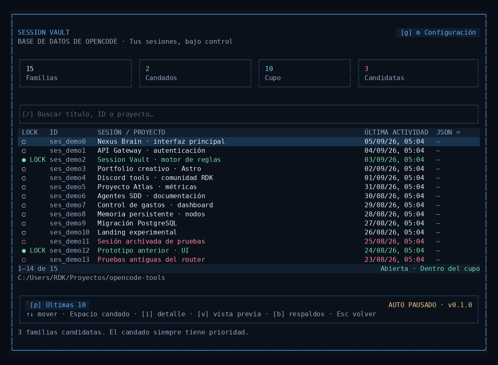

# OpenCode Session Vault

**v0.1.0 · MVP instalable · Interfaz y documentación en español**

Un administrador de sesiones para OpenCode inspirado en tu boceto: ventana azul, lista de sesiones, candados, selector de perfiles, configuración y vista previa de limpieza.



## Empieza aquí

1. Extrae **todo** el ZIP en una carpeta normal.
2. Cierra OpenCode.
3. En Windows, haz doble clic en **INSTALAR.cmd**. En Linux/macOS ejecuta `sh install.sh` desde la carpeta extraída.
4. Abre OpenCode y escribe **`/session-vault`**. También admite `/sesiones-db` y `Alt+Shift+S`.
5. Pon candados con **Espacio** en las conversaciones importantes.
6. Pulsa **v** para revisar la limpieza. Si quieres aplicarla, pulsa **c** y escribe **LIMPIAR**.
7. Para automatizarlo, entra en **g → a** y escribe **ACTIVAR**.

**Necesitas OpenCode 1.18.29 y Node.js 22.6 o posterior para el instalador.** Se comprobó el funcionamiento en OpenCode 1.18.29, Linux. El paquete admite la rama 1.x posterior mediante comprobaciones de capacidad; esas versiones no se han probado. No es compatible con OpenCode 2 beta. Node.js se descarga desde [nodejs.org](https://nodejs.org/). No necesitas compilar, ejecutar npm ni instalar Bun para usar el ZIP.

La ventana requiere al menos **70 columnas y 30 filas**; recomendado: 110 × 40 o más. Si falta espacio, maximiza la terminal o reduce un poco el tamaño de letra.

## Qué conserva

- **Filosofía 'Ver todo; limpiar proyecto'**: La TUI muestra el inventario completo de sesiones de todos los proyectos registrados en OpenCode para facilitar la inspección global y la gestión de candados. La limpieza (tanto manual como automática en segundo plano) se restringe estrictamente a las sesiones del **proyecto activo**.
- Protege sesiones de otros proyectos: las conversaciones ajenas al proyecto actual reciben el motivo de retención `Otro proyecto` y nunca son candidatas a borrado, incluso si existe una configuración previa persistida con ámbito global.
- Requiere identidad de proyecto activa válida: si no se puede identificar con certeza el proyecto actual, la generación de candidatos y la limpieza se suspenden de forma estricta (fail-closed).
- Liveness robusto ante rutas obsoletas: si un proyecto histórico o directorio antiguo ya no existe en disco o produce error de estado, el inventario global continúa accesible sin marcar esas sesiones como inactivas ni permitir su borrado. Si la liveness del proyecto activo falla, la operación aborta por seguridad.
- Ordena por **última actualización**, nunca por fecha de creación.
- Un candado conserva la sesión y su familia, aunque sea muy antigua.
- Una familia contiene la conversación principal y sus sesiones hijas, por ejemplo subagentes. La actividad de una hija actualiza la antigüedad efectiva de la familia.
- Las sesiones abiertas en instancias participantes, las que trabajan, las archivadas por defecto y las de las últimas 24 horas reciben protección adicional.
- Los candados **no gastan el cupo**. Con cupo 10 y 3 familias protegidas por candado pueden conservarse 13 o más, si hay otras protecciones.
- Cambiar de perfil no borra inmediatamente nada.

## Perfiles

| Perfil | Cuánto conserva |
|---|---|
| Últimas 10 — predeterminado | 10 familias recientes sin candado, más las protegidas |
| Básico | Cupo inicial del 15% |
| Moderado | Cupo inicial del 25% |
| Conservador | Cupo inicial del 40% |
| Mod | Porcentaje entero entre 1 y 100 |

**Ejemplo:** hay 100 familias sin candado; Moderado fija un cupo de 25. Después de limpiar sigue conservando 25; mañana una conversación nueva desplaza a la más antigua cuando deja de estar protegida. No vuelve a calcular el 25% de las 25 restantes. Eso evitaría que una limpieza repetida reduzca el historial hasta casi desaparecer.

Los porcentajes se redondean hacia arriba, con mínimo de 1. Para cambiar la base del cálculo usa **Configuración → Recalcular cupo**. El porcentaje se aplica a familias sin candado, no a filas individuales de subagentes.

## Automático, explicado fácil

Arranca **pausado** y con el perfil **Últimas 10**. Al activarlo, OpenCode revisa si corresponde limpiar cada minuto; el intervalo configurado es de 30 minutos entre ejecuciones. Hace lotes de hasta 10 familias, comenzando por las más antiguas. No ejecuta limpieza automática mientras haya un diálogo abierto.

Funciona **mientras la TUI de OpenCode esté abierta**, incluso con la ventana de Session Vault cerrada. No instala un servicio del sistema. Usa una sola instancia de OpenCode al limpiar: el plugin bloquea el borrado si detecta otros procesos participantes. No puede detectar con certeza todos los clientes, servidores o herramientas que no cargan este plugin.

## Tamaño y recuperación de espacio

La columna **JSON ≈** muestra el tamaño lógico de la conversación exportable; se calcula al abrir **i / detalle**. `—` significa que aún no se ha calculado. No representa bytes físicos de SQLite ni una promesa de espacio recuperable.

Antes de borrar, guarda una copia comprimida de las conversaciones y verifica su contenido. Los respaldos también ocupan espacio y se conservan hasta que decidas purgarlos. Para reducir el archivo `opencode.db`, usa el mantenimiento opcional, con OpenCode cerrado. Consulta [Mantenimiento y recuperación](docs/05-MANTENIMIENTO.md).

No elimina archivos de tus proyectos, claves API, memorias de Engram, snapshots de código ni vacía `tool-output`.

## Contenido del paquete

| Archivo o carpeta | Para qué sirve |
|---|---|
| `INSTALAR.cmd`, `install.sh` | Instalar sin compilar |
| `DESINSTALAR.cmd` | Retirar la integración; conserva candados y respaldos |
| `RESTAURAR.cmd` | Extraer un respaldo verificado y generar instrucciones de importación |
| `PURGAR-RESPALDOS.cmd` | Revisar y eliminar copias de más de 30 días con confirmación |
| `REPARAR-BLOQUEO.cmd` | Recuperar una operación interrumpida con OpenCode cerrado |
| `dist/` | Plugin y utilidades ya compilados |
| `src/`, `test/`, `scripts/` | Código fuente, pruebas y herramientas de desarrollo |
| `docs/` | Auditoría, PRD, ARD, MVP, fases, mantenimiento y validación |
| `assets/` | Capturas del renderizador real con datos ficticios y resultado de integración |
| `SHA256SUMS.txt` | Huellas de los archivos para comprobar integridad |

## Configuración e instalación manual

El instalador agrega únicamente su entrada a `tui.json` o `tui.jsonc`, conserva los demás plugins y guarda una copia antes de modificar la configuración. No modifica el código del ODD Profile Manager (ID de paquete heredado `opencode-sdd-profile-manager`). La integración se instala en `~/.config/opencode/extensions/session-vault/`; el instalador respeta `OPENCODE_CONFIG_DIR` y `XDG_CONFIG_HOME`.

Instalación personalizada:

```sh
node dist/install.mjs --config-dir "/ruta/config/opencode"
node dist/install.mjs --config-dir "/ruta/config/opencode" --dry-run
```

Si existen simultáneamente `tui.json` y `tui.jsonc`, indica el archivo que usa tu instalación mediante `--config-file`. No adivina ni sobrescribe los dos.

Los candados, ajustes y respaldos se guardan por defecto en:

- Windows: `%USERPROFILE%\.local\state\opencode-session-vault\`
- Linux/macOS: `~/.local/state/opencode-session-vault/`
- Si existe `XDG_STATE_HOME`, usa esa ubicación.
- `OPENCODE_SESSION_VAULT_HOME` permite elegir una carpeta propia para estos datos.

Para desinstalar desde cualquier sistema: `node dist/install.mjs --uninstall`. Reinicia OpenCode. El archivo instalado queda inactivo y los datos de Session Vault se conservan.

## Desarrollo y validación

```sh
npm ci
npm test
npm run typecheck
npm run build
```

La prueba gráfica requiere Bun: `node scripts/build-ui-smoke.mjs` y `bun --conditions=browser scripts/ui-smoke.mjs`. La integración usa el ejecutable indicado en `OPENCODE_TEST_BINARY` y una base temporal aislada: `node --experimental-strip-types scripts/integration.mjs`.

**Resultados:** 29 pruebas unitarias/funcionales; compilación y TypeScript correctos; navegación real del renderizador OpenTUI; apertura mediante comando dentro de OpenCode; borrado de tres familias de prueba y recuperación de un chat mediante el CLI real. Windows/macOS nativos quedan pendientes de verificación en esos sistemas. Detalles en [Validación](docs/06-VALIDACION.md).

Licencia MIT. Diseño e implementación nuevos; patrones de integración auditados en el repositorio de referencia. Ver `NOTICE.md` y `THIRD-PARTY-NOTICES.txt`.
