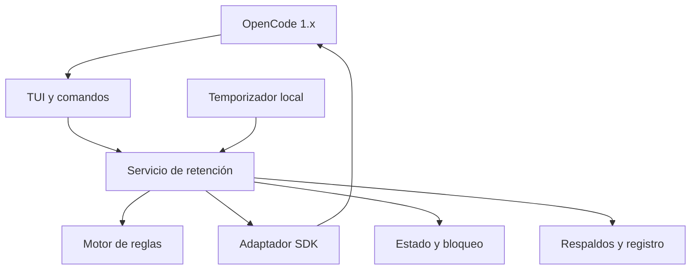
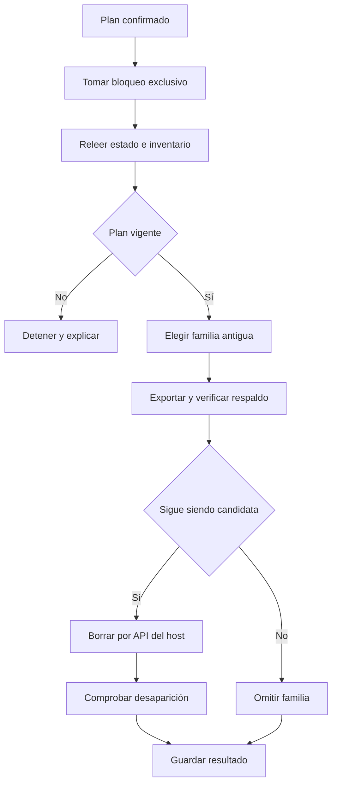

# ARD — Arquitectura y decisiones

## Estructura

| Módulo | Responsabilidad | Restricción |
|---|---|---|
| `model.ts` | Contratos, perfiles y valores iniciales | Sin acceso al host |
| `policy.ts` | Familias, validación, cupos y candidatos | Cálculo determinista, sin I/O |
| `api.ts` | Inventario global, estados, mensajes y borrado por SDK | Rechaza respuestas incompletas |
| `store.ts` | Estado versionado, exclusión y escritura atómica | No modifica la base OpenCode |
| `archive.ts` | Copias gzip, hashes y manifiestos | Debe verificar copia antes de borrar |
| `service.ts` | Planificar, revalidar, ejecutar y registrar | Es la única coordinación de borrado |
| `leases.ts` | Sesiones abiertas en procesos participantes | No es un detector universal de clientes |
| `tui.tsx` | Registro, ciclo de vida, timer y compatibilidad | Sin turno de modelo |
| `ui.tsx` | Pantallas, teclado, ratón y presentación | Invoca al servicio |
| `scripts/install.ts` | Instalar/desinstalar con edición JSONC | Conserva otras entradas |

## Flujo de limpieza

Una ejecución acepta solo los IDs revisados en la vista previa y un máximo configurado de familias. Relee el inventario antes y después del respaldo. La huella usa IDs, padres y fechas, y la revisión de estado invalida planes de más de cinco minutos o con configuración diferente.

## Persistencia

`state.json` contiene schema 1 o 2 (con migración atómica versionada bajo bloqueo exclusivo que inicializa el modo global con automático pausado de forma segura), revisión, perfil, porcentaje, ámbito, protecciones, cupos aislados y última ejecución. Las copias están en `backups/<id>/`; cada conversación tiene su JSON gzip y un manifiesto registra tamaños, hash SHA-256 y estado. `history/` contiene un recibo JSON por ejecución. `instances/` registra actividad de procesos TUI participantes. `operation.lock` serializa limpieza y cambios de candados/configuración.

Se escribe un temporal en el mismo directorio, se sincroniza el archivo y se renombra. Se usan permisos restrictivos cuando el sistema los admite. En Windows los ACL del directorio del usuario siguen siendo relevantes; `mode: 0600` no es una implementación de cifrado ni aislamiento equivalente a los permisos POSIX.

El bloqueo no caduca por tiempo. Una pausa larga no prueba que una operación haya muerto. El reparador verifica que el PID registrado ya no existe y solicita confirmar que OpenCode está cerrado. En caso de contenido corrupto no se restablecen ajustes silenciosamente.

## Decisiones de arquitectura

| ADR | Decisión | Motivo y consecuencia |
|---|---|---|
| 001 | API OpenCode para borrar | Conserva la lógica de hijos y eventos del host; evita acoplar el plugin al esquema SQL |
| 002 | Familias indivisibles | Un candado de subagente no puede perderse por borrar al padre |
| 003 | Cupo porcentual persistido | Evita erosión geométrica; requiere acción explícita para recalcular |
| 004 | Respaldo obligatorio del chat | Fallo de copia bloquea la familia; requiere espacio adicional |
| 005 | JSON lógico bajo demanda | No atribuye páginas SQLite compartidas a una sesión arbitrariamente |
| 006 | Módulo TUI 1.x | Coincide con la referencia instalada; v2 necesita un adaptador aparte |
| 007 | Sin dependencias gráficas duplicadas | Bundle externo a Solid/OpenTUI, resuelto por el host |
| 008 | Local y una instancia al limpiar | La API de estado no coordina universalmente todos los servidores |
| 009 | Automático dentro del ciclo TUI | No instala daemon; timers y registros se limpian al cerrar |
| 010 | Lista completa con límite creciente | Evita saltos en empates del cursor temporal; aborta al superar el techo |
| 011 | Alcance global verificado y protección multi-proyecto | Inventario global (`directory: ""`); verificación segura de liveness multi-directorio con concurrencia acotada (máx. 4); protección explícita de actividad no verificada; fallo cerrado en directorios inexistentes sin boot storm; automático inicialmente pausado |

## Límites conocidos y tratamiento

**Ámbito y proyectos:** el inventario global es visible en su totalidad. Con alcance global (`scope: "global"`), se permite limpieza coordinada a través de proyectos tras verificar la actividad de cada directorio relevante con concurrencia acotada (máximo 4 llamadas simultáneas) y timeout. Cualquier directorio inexistente o fallo de estado protege inmediatamente a las sesiones afectadas como "Actividad no verificada", y cualquier miembro no verificado retiene y protege a toda la familia indivisible. El modo automático se inicializa pausado y requiere confirmación manual previa. Si la identidad del proyecto activo falta, la operación se detiene por seguridad (fail-closed).

**Concurrencia:** el servidor no ofrece un DELETE condicional atómico sobre versión/estado. Entre la última comprobación y el borrado queda una ventana residual; el plugin minimiza esa ventana y limita el uso admitido a una instancia local. No promete exclusión contra aplicaciones externas que no colaboran.

**Eventos y recuperación:** el formato usado coincide con la exportación de conversaciones del CLI, no con una copia de todas las tablas de eventos. El importador del host ubica el chat en el proyecto/directorio desde el que se ejecuta. Para recuperación íntegra de una base se necesita una copia SQLite completa; la utilidad offline la crea antes de compactar, no antes de cada limpieza.

**Memoria:** la exportación limita páginas de 200 mensajes, máximo 10.000 páginas y 256 MiB por conversación serializada. El límite final no evita todos los picos durante la materialización de mensajes; una copia en streaming es una mejora prevista. Un archivo externo enlazado por un mensaje no se incorpora automáticamente.

**Listado:** una respuesta global ausente, excesiva, con IDs duplicados, fecha inválida, huérfanos o ciclos suspende la limpieza. Bases con jerarquías ya dañadas requieren reparar OpenCode; el plugin no inventa padres ni descarta silenciosamente filas.

**UI:** la geometría compensa la separación superior del diálogo de OpenCode 1.18.29 mediante margen local; no modifica el renderizador ni archivos del host. La compatibilidad visual se debe volver a comprobar si OpenCode cambia sus diálogos. Esc tiene un binding de mayor prioridad mientras el panel está montado, para volver dentro del plugin antes de cerrar el modal del host.

**Seguridad de contenido:** títulos y rutas se muestran eliminando controles de terminal y controles bidireccionales. Los comandos de restauración usan rutas entre comillas y nunca se ejecutan automáticamente. Las copias contienen texto privado de las conversaciones y no se cifran.
