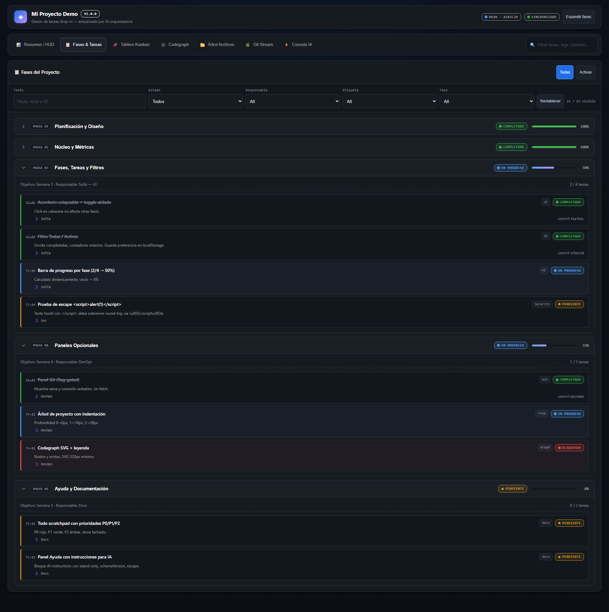
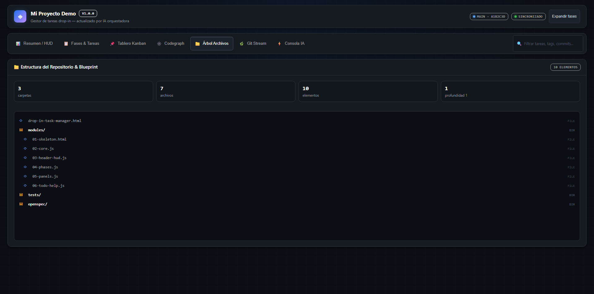

# Task Manager Portable

> A complete project dashboard contained in **a single HTML file**—completely offline, zero installation, no server, and zero runtime dependencies.

<p align="center">
  <a href="./Task-Manager-Portable.html"><strong>Open Portable File</strong></a>
  ·
  <a href="./docs/USAGE.md">Usage Guide</a>
  ·
  <a href="./docs/CUSTOMIZATION.md">Customization</a>
  ·
  <a href="./docs/AI-ORCHESTRATOR-GUIDE.md">AI Integration</a>
</p>


---

## Overview

Task Manager Portable turns your project status into an interactive, visual cockpit that lives right alongside your code. Simply place `Task-Manager-Portable.html` in any project root, open it with a double click in any modern browser, and update its embedded JSON state block.

| Feature | Specification |
|---|---|
| **Distribution** | Single self-contained HTML file |
| **Installation** | None |
| **Server Requirement** | None (runs offline via `file://`) |
| **Data Format** | Embedded JSON island `#tm-state` |
| **Runtime Dependencies** | Zero |
| **Browser Compatibility** | Modern Chrome, Edge, Firefox, and Safari |

---

## Quick Start

1. Copy [`Task-Manager-Portable.html`](./Task-Manager-Portable.html) into your project root.
2. Double-click the file to open it in your browser.
3. Customize the `<script type="application/json" id="tm-state">` block directly or instruct an AI assistant to keep it updated.

```text
my-project/
├── src/
├── README.md
└── Task-Manager-Portable.html  ← open with double-click
```

> **Security Note**: Web browsers intentionally prevent `file://` HTML files from reading local directories or filesystem contents. Data is supplied exclusively through the embedded JSON block to guarantee maximum security, sandboxing, and portability.

---

## Visual Tour

### 1. Executive Summary & HUD
The Header HUD consolidates overall project progress, risk indicators, task distribution, current SDD phase, Git lineage, test coverage, and key insights.


### 2. Phases & Tasks Breakdown
Explore tasks grouped by project phase, filter by search text, status, owner, tag, or phase, and expand detail cards.



### 3. Kanban Board
Visualize tasks categorized into *Pending*, *In-Progress*, *Blocked*, and *Completed* columns.


### 4. CodeGraph Map
Inspect declared codebase modules, symbol dependencies, and impact boundaries.


### 5. Repository Blueprint Tree
Document folders, files, nesting depth, and general structural layout in a clean tree view.



### 6. Git Timeline
Audit declared Git commits, branch synchronization, and receipt verification history without touching `.git` directly.


### 7. AI Console & Telemetry
Access AI instructions, starter prompts, project health diagnostics, and JSON state export tools.


---

## How It Works

All visual elements derive from a single declarative source of truth:

```html
<script type="application/json" id="tm-state">
{
  "schemaVersion": "1.0",
  "meta": { "projectName": "My Project", "version": "1.0.0" },
  "phases": [],
  "todos": [],
  "git": {},
  "tree": [],
  "codegraph": {}
}
</script>
```

The client-side engine validates the state and automatically derives:
- Global and per-phase completion percentages;
- Status distribution counts;
- Active workload, blockers, and risk scores;
- Kanban board columns and task filter views;
- Git, Tree, and CodeGraph visualizations;
- Non-blocking diagnostics and recovery banners.

See [`docs/CUSTOMIZATION.md`](docs/CUSTOMIZATION.md) for full schema details.

---

## AI Assistant Integration

You can provide the following operational directive to OpenCode, Claude, Codex, Cursor, or any LLM orchestrator:

```text
Keep ./Task-Manager-Portable.html updated based on project progress.

Rules:
- Edit ONLY the JSON content inside the <script type="application/json" id="tm-state"> block.
- Maintain schemaVersion "1.0".
- Use status: "pending", "in-progress", "completed", or "blocked".
- Escape any closing script tag as \u003c/script\u003e within text strings.
- Do not add fetch calls, imports, external scripts, or runtime dependencies.
- Do not modify HTML, CSS, or JavaScript outside the JSON island.
```

For comprehensive AI orchestrator instructions, see [`docs/AI-ORCHESTRATOR-GUIDE.md`](docs/AI-ORCHESTRATOR-GUIDE.md).

---

## Repository Structure

```text
plugins/task-manager/
├── Task-Manager-Portable.html   # Standalone executable file (open with double-click)
├── modules/                     # Source modular HTML, CSS, and JavaScript
├── scripts/                     # Assembler and portability scanner
├── tests/                       # Unit tests and Playwright browser validation
├── docs/                        # Documentation and screenshots
│   ├── image/
│   ├── USAGE.md
│   ├── CUSTOMIZATION.md
│   ├── ARCHITECTURE.md
│   ├── DEVELOPMENT.md
│   └── AI-ORCHESTRATOR-GUIDE.md
├── CHANGELOG.md
├── CONTRIBUTING.md
├── SECURITY.md
└── LICENSE
```

---

## Development & Assembly

The distributable HTML does not require Node.js. Node is used only to develop, test, and assemble the modular source files:

```bash
# Install development dependencies
npm install

# Run unit tests
npm test

# Typecheck JavaScript with TypeScript checkJs
npm run check

# Assemble HTML from modules
npm run assemble

# Run Playwright browser test
npm run test:browser

# Audit offline portability and size
node scripts/scan-portability.mjs
```

---

## Known Boundaries & Limitations

- Does not auto-inspect the filesystem or `.git` due to browser `file://` security sandboxing.
- All displayed metrics represent declared snapshots inside `#tm-state`.
- Read-only interface: does not execute terminal commands or mutate files directly.

---

## License

Distributed under the [MIT License](LICENSE).
